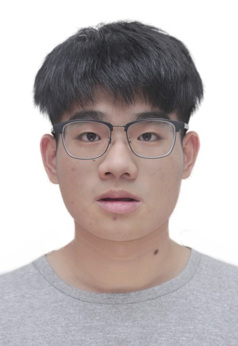

## ## 应聘简历：陈霖（chenlin）

### ### 个人信息
> **电话**：13049097879			**邮箱**：807686672@qq.com		   **微信**：CodeClsld
> **年龄**：1999-08-17			 **政治面貌**：中共党员				 
> **现居城市**：广东广州						 **博客**：https://coderclsld.github.io/
> **Gitee：**https://gitee.com/clsld 		**Github：**https://github.com/coderclsld

### ### 教育经历

> ##### 广州软件学院 本科 电子系通信工程专业									2018-09 —— 2022-06
> - 专业排名前 10%，获得**学生奖学金**三等奖、**计算机二级证书**、**英语四级证书**、**优秀毕业论文**等
> - 积极参加学科专业竞赛，获得**智能车竞赛二等奖**，**电子设计大赛优秀奖**等
### ### 工作项目经历
>##### 火烈鸟网络股份有限公司		Go开发工程师   平台研发部			   	2022-05 —— 2023-03
>
>- 负责公司产品**果盘游戏**、**66手游**等游戏平台的版本迭代开发和优化（社区、活动）。
>- 负责运营后台管理系统的开发和维护以及老运营后台的迁移工作。
>- 负责**视频压缩截图**、竞渠游戏**爬虫监控**、**网页截图识别**等基础服务的开发。
>##### 广州虎牙信息科技公司		Java开发实习生  基础保障部     			   2021-07 —— 2021-11
>- 参与公司**分布式链路项目**的开发，实现应用性能监控、错误分析定位，可视化数据展示等功能。
>- 负责公司**邮件报表项目**的开发，对虎牙直播的各项指标数据进行查询分析、生成模板并发送机器人通知。
>- 参与**镜像管理项目**中容器自愈功能的开发、公告信息接入等工作，对数据库查询数据慢的问题进行优化实践。 
>##### 汕头市拓路者科技有限公司	前端开发实习生							2020-02 —— 2020-05
>- 参与公司 **智慧泊车** 项目中前端小程序的开发，在此实习期间完成前端小程序的功能实现，
>- 公司技术栈采用基于**vue.js**的**uniapp**框架进行开发，以此达到一套代码多端平台发布的作用。
>- 接触使用**git**进行代码版本，使用jira、trello等协同工具进行敏捷开发。
### ### 专业技能
> - 熟悉go语言，对go内存模型、垃圾回收有初步理解，熟悉gin、grpc等开源框架，了解其核心实现机制。
> - 熟悉Java语言，对JVM原理有初步的理解，熟悉Spring、SpringCloud等开源框架，了解其核心实现机制。
> - 熟悉Mysql以及常见优化的手段，熟悉Redis的使用和缓存同步解决方案、以及Redis集群的搭建和实现机制。
> - 掌握Kafka的使用和实现机制原理，掌握Nginx等web服务器的配置，掌握ELK日志收集系统的搭建和使用。
### ### 校园项目经历
> ##### 项目名称：校园社交平台												2020-08 —— 2021-04
>    代码链接：https://gitee.com/clsld/school-springcloud
> - 使用**SpringCloud**开发，**Mysql**进行数据持久化，使用**Redis**进行缓存，使用**Elasticsearch**进行检索
> - 搭建**DFS**,使用Dockerfile构建成**Docker**镜像容器化部署，使用**SkyWalking**进行分布式链路监控。
> - 使用**Netty**+**WebSocket**实现即时通信，对不在线的用户收到的信息使用Redis 做消息队列对数据进行缓存。
> ##### 项目名称：分布式集群的实现 											2020-08 —— 2020-09
> - 使用九台虚拟机进行**分布式集群的搭建**，实现Web服务器搭建、**反向代理**、负载均衡、缓存以及一些常用模块的应用(包括调试输出、**网页压缩**、重写、重定向、**防盗链**、HTTPS等)
> - **Nginx +Keepalived**实现高可用，配置NFS服务器实现文件存储和挂载，实现 MySQL读写分离、主从复制

### ### 个人照片

  

### 开头
It's my pleasure,thank you so much for meeting with me !

### 自我介绍
I am Chen Lin. I got my undergraduate degree in Guangzhou Institute of Software. My major is communication engineering.

### 个人经历
In my sophomore year, I interned at a startup company, and in my senior year, I worked as an intern as a development engineer in Huya Live. Then I joined my current company while recruiting(recoolting) on campus,which I have now left.

That's my self introduction,thank you !

### 听不懂
Can you repeat the question

### 优点
My advantage is that I do things with a plan. I will make a todo list of things I want todo every day. This is also my way to learn new knowledge in depth

### 缺点
My weakness is that I am not confident enough and I will not show my good parts. But gradually I also changed myself, from sharing some work experience in meetings, to breaking my own English deficiency for the company I wanted to work for.

### 离职原因
Companies lay off employees for business reasons, not personal reasons

### 未来打算
I want to be a senior development engineer and take charge of key technology development in the company, which will make me feel fulfilled

