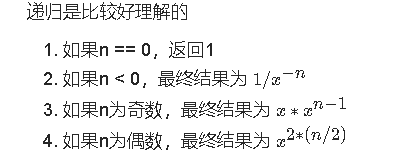

## 剑指offter刷题笔记
### [数组中重复的数字](https://leetcode-cn.com/problems/shu-zu-zhong-zhong-fu-de-shu-zi-lcof)

> 找出数组中重复的数字。在一个长度为 n 的数组 nums 里的所有数字都在 0～n-1 的范围内。数组中某些数字是重复的，但不知道有几个数字重复了，也不知道每个数字重复了几次。请找出数组中任意一个重复的数字。
>
> ```
> 输入：
> [2, 3, 1, 0, 2, 5, 3]
> 输出：2 或 3 
> ```
>
> 

```java
class Solution {
    public int findRepeatNumber(int[] nums) {
        Set set = new HashSet();
        for(int i = 0 ; i< nums.length;i++){
            if(!set.add(nums[i])){
                return nums[i];
            }
        }
        return -1;
    }
}
```

### [二维数组中的查找(排序算法)](https://leetcode-cn.com/problems/er-wei-shu-zu-zhong-de-cha-zhao-lcof)

> 在一个 n * m 的二维数组中，每一行都按照从左到右递增的顺序排序，每一列都按照从上到下递增的顺序排序。请完成一个高效的函数，输入这样的一个二维数组和一个整数，判断数组中是否含有该整数。
>
> **示例:**
>
> 现有矩阵 matrix 如下：
>
> [
> 	[1,   4,  7, 11, 15],
> 	[2,   5,  8, 12, 19],
> 	[3,   6,  9, 16, 22],
> 	[10, 13, 14, 17, 24],
> 	[18, 21, 23, 26, 30]
> ]
>
> 给定 target = `5`，返回 `true`。
>
> 给定 target = `20`，返回 `false`。

```java
class Solution {
    public boolean findNumberIn2DArray(int[][] matrix, int target) {
        //暴力循环
        for(int i = 0 ; i <matrix.length;i++)
            for(int j = 0 ;j <matrix[0].length;j++){
                if(matrix[i][j] == target){
                    return true;
            }
         }
         return false;
        
        // 线性查找：首先是通过第一行的每一个元素与target进行比较，如果比target小的话，那么targrt则有可能在这个元素所在的列中即在该元素的下方，如果比target大的话，那么target则有可能在这个元素的左边。分析代码完后我们从这个数组的右上角开始
        if (matrix == null || matrix.length == 0 || matrix[0].length == 0)return false;
        int hanshu = 0;
        int lieshu = matrix[0].length-1;
        while(lieshu >= 0 && hanshu <= matrix.length-1){
            if(matrix[hanshu][lieshu] == target){
                return true;
            }else if(matrix[hanshu][lieshu] > target){
                lieshu -- ;
            }else{
                hanshu ++;
            }
        }
        return false;
    }
}
```

### [替换空格](https://leetcode-cn.com/problems/ti-huan-kong-ge-lcof)

>请实现一个函数，把字符串 `s` 中的每个空格替换成"%20"。
>
>**示例 1：**
>
>```
>输入：s = "We are happy."
>输出："We%20are%20happy."
>```
>
>

```java
class Solution {(
    //自己写的答案用java自带的子字符串函数replaceSpace()
    public String replaceSpace(String s) {
        s.replaceSpace(" ","%20");
        return s;
    }
    //leetcode官方
    public String replaceSpace(String s) {
        int length = s.length();
        char[] array = new char[length * 3];
        int size = 0;
        for (int i = 0; i < length; i++) {
            char c = s.charAt(i);
            if (c == ' ') {
                array[size++] = '%';
                array[size++] = '2';
                array[size++] = '0';
            } else {
                array[size++] = c;
            }
        }
        String newStr = new String(array, 0, size);
        return newStr;
    }
}
```


### [ 从尾到头打印链表(反转链表)](https://leetcode-cn.com/problems/cong-wei-dao-tou-da-yin-lian-biao-lcof)

> 输入一个链表的头节点，从尾到头反过来返回每个节点的值（用数组返回）。
>
> **示例 1：**
>
> ```
> 输入：head = [1,3,2]
> 输出：[2,3,1]
> ```

```java
class Solution {
    //用栈实现
    public int[] reversePrint(ListNode head) {
        Stack<ListNode> stack = new Stack<ListNode>();
        ListNode temp = head;
        while (temp != null) {
            stack.push(temp);
            temp = temp.next;
        }
        int size = stack.size();
        int[] print = new int[size];
        //入栈后一个个弹出节点的值即可
        for (int i = 0; i < size; i++) {
            print[i] = stack.pop().val;
        }
        return print;
    }
    
    
    //递归实现从尾到头输出
    ArrayList<Integer> arrayList = new ArrayList<Integer>();
    public ArrayList<Integer> printListFromTailToHead(ListNode listNode) {
        if(listNode!=null){
            //精髓是递归它会先走到无路可走的时候才向上返回，这样可以从一开始就返回节点并且逐个向上返回，我们只需要创建一个数据用以接收返回的节点即可
            this.printListFromTailToHead(listNode.next);
            arrayList.add(listNode.val);
        }
        return arrayList;
    }
    
    //递归反转整个链表，真正的反转链表
    ListNode reverse(ListNode head) {
    if (head.next == null) return head;
    //这里返回每一个修改后的节点
    ListNode last = reverse(head.next);
    //这是把倒数第二个节点连接到倒数第一个节点的next上，因为虽然倒数第二个节点的位置改变了，但是倒数第三个节点还是连接着倒数第二个节点，即倒数第三个节点还保存着倒数第二个节点的位置，所以递归向上的操作可以像依照本轮的节点处理一样，依此类推。
    head.next.next = head;
    head.next = null;
    return last;
}
}
```

- #### [递归反转链表解题思路](https://labuladong.github.io/algo/%E6%95%B0%E6%8D%AE%E7%BB%93%E6%9E%84%E7%B3%BB%E5%88%97/%E9%80%92%E5%BD%92%E5%8F%8D%E8%BD%AC%E9%93%BE%E8%A1%A8%E7%9A%84%E4%B8%80%E9%83%A8%E5%88%86.html)

### [重建二叉树(二叉树)](https://leetcode-cn.com/problems/zhong-jian-er-cha-shu-lcof)

> 输入某二叉树的前序遍历和中序遍历的结果，请重建该二叉树。假设输入的前序遍历和中序遍历的结果中都不含重复的数字。
>
> 例如，给出
>
> ```
> 前序遍历 preorder = [3,9,20,15,7]
> 中序遍历 inorder = [9,3,15,20,7]
> ```
>
> 返回如下的二叉树：
>
> ```
>      3
>     / \
>   9  20
>      /  \
>     15   7
> ```

```java
class Solution {
    //使用hashMap
    private Map<Integer, Integer> indexMap;
    public TreeNode myBuildTree(int[] preorder, int[] inorder, int preorder_left, int preorder_right, int inorder_left, int inorder_right) {
        if (preorder_left > preorder_right) {
            return null;
        }
        int preorder_root = preorder_left;
        int inorder_root = indexMap.get(preorder[preorder_root]);
        TreeNode root = new TreeNode(preorder[preorder_root]);
        int size_left_subtree = inorder_root - inorder_left;
        root.left = myBuildTree(preorder, inorder, preorder_left + 1, preorder_left + size_left_subtree, inorder_left, inorder_root - 1);
        root.right = myBuildTree(preorder, inorder, preorder_left + size_left_subtree + 1, preorder_right, inorder_root + 1, inorder_right);
        return root;
    }

    public TreeNode buildTree(int[] preorder, int[] inorder) {
        int n = preorder.length;
        indexMap = new HashMap<Integer, Integer>();
        for (int i = 0; i < n; i++) {
            indexMap.put(inorder[i], i);
        }
        return myBuildTree(preorder, inorder, 0, n - 1, 0, n - 1);
    }
    //不使用hashMap
    public TreeNode buildTree(int[] preorder, int[] inorder) {
        return help(preorder,0,preorder.length-1,inorder,0,inorder.length-1);
    }
    public TreeNode help(int[] preorder,int l1,int r1,int[] inorder,int l2,int r2){
        if(l1>r1||l2>r2) return null;//这个很重要
        int i =l2;
        while(inorder[i]!=preorder[l1]){//在中序数组中去寻找根节点
            i++;
        }
        TreeNode root = new TreeNode(preorder[l1]);
        root.left = help(preorder,l1+1,l1+i-l2,inorder,l2,i-1);
        root.right = help(preorder,l1+i-l2+1,r1,inorder,i+1,r2);
        return root;
    }
}
```


### [ 用两个栈实现队列(栈)](https://leetcode-cn.com/problems/yong-liang-ge-zhan-shi-xian-dui-lie-lcof)

> 用两个栈实现一个队列。队列的声明如下，请实现它的两个函数 appendTail 和 deleteHead ，分别完成在队列尾部插入整数和在队列头部删除整数的功能。(若队列中没有元素，deleteHead 操作返回 -1 )
>
> 示例 1：
>
> ```
> 输入：
> ["CQueue","appendTail","deleteHead","deleteHead"]
> [[],[3],[],[]]
> 输出：[null,null,3,-1]
> ```
>
> 示例 2：
>
> ```
> 输入：
> ["CQueue","deleteHead","appendTail","appendTail","deleteHead","deleteHead"]
> [[],[],[5],[2],[],[]]
> 输出：[null,-1,null,null,5,2]
> ```

```java
class CQueue {
    //官方的解答
    Deque<Integer> stack1;
    Deque<Integer> stack2;
    public CQueue() {
        stack1 = new LinkedList<Integer>();
        stack2 = new LinkedList<Integer>();
    }
    public void appendTail(int value) {
        stack1.push(value);
    }
    public int deleteHead() {
        // 如果第二个栈为空
        if (stack2.isEmpty()) {
            while (!stack1.isEmpty()) {
                stack2.push(stack1.pop());
            }
        } 
        if (stack2.isEmpty()) {
            return -1;
        } else {
            int deleteItem = stack2.pop();
            return deleteItem;
        }
    }
}
```


### [斐波那契数列](https://leetcode-cn.com/problems/fei-bo-na-qi-shu-lie-lcof)

>写一个函数，输入 `n` ，求斐波那契（Fibonacci）数列的第 `n` 项（即 `F(N)`）。斐波那契数列的定义如下：
>
>```
>F(0) = 0,   F(1) = 1
>F(N) = F(N - 1) + F(N - 2), 其中 N > 1.
>```
>
>斐波那契数列由 0 和 1 开始，之后的斐波那契数就是由之前的两数相加而得出。
>
>**示例 1：**
>
>```
>输入：n = 2
>输出：1
>```
>
>**示例 2：**
>
>```
>输入：n = 5
>输出：5
>```
>
>答案需要取模 1e9+7（1000000007），如计算初始结果为：1000000008，请返回 1。

```java
class Solution {
    public int fib(int n) {
        int a = 0, b = 1, sum;
        for(int i = 0; i < n; i++){
            sum = (a + b) % 1000000007;
            a = b;
            b = sum;
        }
        return a;
    }
}
```


### [ 青蛙跳台阶问题](https://leetcode-cn.com/problems/qing-wa-tiao-tai-jie-wen-ti-lcof)

> 一只青蛙一次可以跳上1级台阶，也可以跳上2级台阶。求该青蛙跳上一个 `n` 级的台阶总共有多少种跳法。答案需要取模 1e9+7（1000000007），如计算初始结果为：1000000008，请返回 1。
>
> **示例 1：**
>
> ```
> 输入：n = 2
> 输出：2
> ```
>
> **示例 2：**
>
> ```
> 输入：n = 7
> 输出：21
> ```
>
> **示例 3：**
>
> ```
> 输入：n = 0
> 输出：1
> ```

```java
class Solution {
    public int numWays(int n) {
        int a = 1, b = 1, sum;
        for(int i = 0; i < n; i++){
            sum = (a + b) % 1000000007;
            a = b;
            b = sum;
        }
        return a;
    }
}
```


### [旋转数组的最小数字](https://leetcode-cn.com/problems/xuan-zhuan-shu-zu-de-zui-xiao-shu-zi-lcof)

> 把一个数组最开始的若干个元素搬到数组的末尾，我们称之为数组的旋转。输入一个递增排序的数组的一个旋转，输出旋转数组的最小元素。例如，数组 [3,4,5,1,2] 为 [1,2,3,4,5] 的一个旋转，该数组的最小值为1。  
>
> **示例 1：**
>
> ```
> 输入：[3,4,5,1,2]
> 输出：1
> ```
>
> **示例 2：**
>
> ```
> 输入：[2,2,2,0,1]
> 输出：0
> ```
>
> 

```java
public class Solution {
    public int minNumberInRotateArray(int [] array) {
        if (array.length == 0 || array == null)
            return 0;
        int l=0, r=array.length-1;
        while(l < r) {
            if (array[l] < array[r])    //防止出现 1 0 1 1 1这种情况
                return array[l];
            int mid=(l+r)/2;
            if (array[l] < array[mid])    //说明最小元素一定在右边
                l=mid+1;
            else if (array[r] > array[mid])    //说明最小元素一定在左边
                r=mid;
            else
                l++;    //否则往后遍历继续二分
        }
        return array[l];
    }
}
```

### [矩阵中的路径(动态规划)](https://leetcode-cn.com/problems/ju-zhen-zhong-de-lu-jing-lcof)

> 给定一个 `m x n` 二维字符网格 `board` 和一个字符串单词 `word` 。如果 `word` 存在于网格中，返回 `true` ；否则，返回 `false` 。
>
> 单词必须按照字母顺序，通过相邻的单元格内的字母构成，其中“相邻”单元格是那些水平相邻或垂直相邻的单元格。同一个单元格内的字母不允许被重复使用。
>
> 例如，在下面的 3×4 的矩阵中包含单词 "ABCCED"（单词中的字母已标出）。
>
> 
>
> 示例 1：
>
> ```
> 输入：board = [["A","B","C","E"],["S","F","C","S"],["A","D","E","E"]], word = "ABCCED"
> 输出：true
> ```
>
>
> 示例 2：
>
> ```
> 输入：board = [["a","b"],["c","d"]], word = "abcd"
> 输出：false
> ```

```java
//一开始就找找到第一个相同的值后再递归查找
class Solution {
    int[] dx = {-1, 1, 0, 0};
    int[] dy = {0, 0, -1, 1};
    int m, n; 
    public boolean exist(char[][] board, String word) {
        m = board.length;
        n = board[0].length;
        char[] chars = word.toCharArray();
        for(int i = 0; i < m; i++){
            for(int j = 0; j < n; j++){
                if(board[i][j] == chars[0]){
                    board[i][j] = '/';
                    if(dfs(i, j, 1, board, chars)){
                        return true;
                    }
                    board[i][j] = chars[0];
                }
            }
        }
        return false;
    }
    private boolean dfs(int x, int y, int index, char[][] board, char[] chars){
        if(index == chars.length){
            return true;
        }
        for(int i = 0; i < 4; i++){
            int nx = x + dx[i], ny = y + dy[i];
            if(nx >= 0 && nx < m && ny >= 0 && ny < n && board[nx][ny] == chars[index]){
                board[nx][ny] = '/';
                if(dfs(nx, ny, index + 1, board, chars)){
                    return true;
                }
                board[nx][ny] = chars[index];
            }
        }
        return false;
    }
}


//直接递归查找
public class Solution {
    boolean[][] visited;
    int[][] directions = {{-1, 0}, {0, -1}, {0, 1}, {1, 0}};
    int m,n;
    int len;
    public boolean hasPath (char[][] matrix, String word) {
        m = matrix.length;
        n = matrix[0].length;
        len = word.length();
        visited = new boolean[m][n];
        for(int i = 0;i < m;i++){
            for(int j = 0;j < n;j++){
                if(dfs(matrix,word,i,j,0)){
                    return true;
                }
            }
        }
        return false;
    }
    public boolean dfs(char[][] matrix,String word,int i,int j,int index){
        if(index == len-1){
            return matrix[i][j] == word.charAt(index);
        }
        if(matrix[i][j] == word.charAt(index)){
            visited[i][j] = true;
            for(int k = 0;k < 4;k++){
                int x = i + directions[k][0];
                int y = j + directions[k][1];
                if(inArea(x,y) && !visited[x][y]){
                    if(dfs(matrix,word,x,y,index+1)){
                        return true;
                    }
                }
            }
            visited[i][j] = false;
        }
        return false;
    }
    public boolean inArea(int x,int y){
        return x >= 0 && x < m && y >= 0 && y < n;
    }
}
```

### [机器人的运动范围(动态规划)](https://leetcode-cn.com/problems/ji-qi-ren-de-yun-dong-fan-wei-lcof)

> 地上有一个m行n列的方格，从坐标 [0,0] 到坐标 [m-1,n-1] 。一个机器人从坐标 [0, 0] 的格子开始移动，它每次可以向左、右、上、下移动一格（不能移动到方格外），也不能进入行坐标和列坐标的数位之和大于k的格子。例如，当k为18时，机器人能够进入方格 [35, 37] ，因为3+5+3+7=18。但它不能进入方格 [35, 38]，因为3+5+3+8=19。请问该机器人能够到达多少个格子？
>
> **示例 1：**
>
> ```
> 输入：m = 2, n = 3, k = 1
> 输出：3
> ```
>
> **示例 2：**
>
> ```
> 输入：m = 3, n = 1, k = 0
> 输出：1
> ```

```java
class Solution {
    public int movingCount(int m, int n, int k) {
        if (k == 0) {
            return 1;
        }
        Queue<int[]> queue = new LinkedList<int[]>();
        // 向右和向下的方向数组
        int[] dx = {0, 1};
        int[] dy = {1, 0};
        boolean[][] vis = new boolean[m][n];
        queue.offer(new int[]{0, 0});
        //queue的add()和offer()都是向队列来添加一个元素，在容量满的时候add()会抛异常，
        //而offer方法只会返回false
        vis[0][0] = true;//坐标[0,0]不管怎么样都算一个。
        int ans = 1;//记录小于k的有多少个空格
        while (!queue.isEmpty()) {//队列不为空的时候进入循环
            int[] cell = queue.poll();
            //queue.poll()和queue.remove()都是从队列中删除第一个元素，如果队列为空，
            //调用remove()方法会抛出异常，而poll()方法只会返回null
            int x = cell[0], y = cell[1];
            for (int i = 0; i < 2; ++i) {
                int tx = dx[i] + x;
                int ty = dy[i] + y;
                if (tx >= 0 && tx < m && ty >= 0 && ty < n && !vis[tx][ty] && get(tx) + get(ty) > k) {
                    continue;
                }
                queue.offer(new int[]{tx, ty});
                vis[tx][ty] = true;//将符合条件的格子标记为true
                ans++;//将记数值更新
            }
        }
        return ans;
    }

    private int get(int x) {
        int res = 0;
        while (x != 0) {
            res += x % 10;//将各个位数的值相加累加
            x /= 10;
        }
        return res;
    }
}
```

### [剪绳子 I(动态规划)](https://leetcode-cn.com/problems/jian-sheng-zi-lcof)

> 给你一根长度为 n 的绳子，请把绳子剪成整数长度的 m 段（m、n都是整数，n>1并且m>1），每段绳子的长度记为 k[0],k[1]...k[m-1] 。请问 k[0]*k[1]*...*k[m-1] 可能的最大乘积是多少？例如，当绳子的长度是8时，我们把它剪成长度分别为2、3、3的三段，此时得到的最大乘积是18。
>
> 示例 1：
>
> ```
> 输入: 2
> 输出: 1
> 解释: 2 = 1 + 1, 1 × 1 = 1
> ```
>
>
> 示例 2:
>
> ```
> 输入: 10
> 输出: 36
> 解释: 10 = 3 + 3 + 4, 3 × 3 × 4 = 36
> ```
>
> 

```java
    2	1*1		1
    3	1*2		2
    4	2*2		4
    5	2*3		6
    6	3*3		9
    7	3*4		12
    8	3*3*2	18
    9	3*3*3	27
    10	3*3*4	36
    11	3*3*3*2	54
//动态规划
class Solution {
    public int cuttingRope(int n) {
        int[] dp = new int[n + 1];
        dp[1] = 1;
        dp[2] = 1;
        for(int i = 3; i < n + 1; i++){
            for(int j = 2; j < i; j++){
                dp[i] = Math.max(dp[i], Math.max(j * (i - j), j * dp[i - j]));
            }
        }
        return dp[n];
    }
}

//找数学规律解决
public int cuttingRope(int n) {
    if (n == 2 || n == 3)
        return n - 1;
    int res = 1;
    while (n > 4) {
        //如果n大于4，我们不停的让他减去3
        n = n - 3;
        //计算每段的乘积
        res = res * 3;
    }
    return n * res;
}
```

- #### [leetcode大神解题思路参考](https://leetcode-cn.com/problems/jian-sheng-zi-lcof/solution/shu-xue-zhi-shi-he-dong-tai-gui-hua-liang-chong-fa/)

### [剪绳子 II(动态规划)](https://leetcode-cn.com/problems/jian-sheng-zi-ii-lcof)

> 给你一根长度为 n 的绳子，请把绳子剪成整数长度的 m 段（m、n都是整数，n>1并且m>1），每段绳子的长度记为 k[0],k[1]...k[m - 1] 。请问 k[0]*k[1]*...*k[m - 1] 可能的最大乘积是多少？例如，当绳子的长度是8时，我们把它剪成长度分别为2、3、3的三段，此时得到的最大乘积是18。
>
> 答案需要取模 1e9+7（1000000007），如计算初始结果为：1000000008，请返回 1。
>
> 示例 1：
>
> ```
> 输入: 2
> 输出: 1
> 解释: 2 = 1 + 1, 1 × 1 = 1
> ```
>
>
> 示例 2:
>
> ```
> 输入: 10
> 输出: 36
> 解释: 10 = 3 + 3 + 4, 3 × 3 × 4 = 36
> ```

```java
//动态规划
class Solution {
    public int cuttingRope(int n) {
        BigInteger[] dp = new BigInteger[n + 1];
         Arrays.fill(dp, BigInteger.valueOf(1));
        // dp[1] = BigInteger.valueOf(1);
        for(int i = 3; i < n + 1; i++){
            for(int j = 1; j < i; j++){
                dp[i] = dp[i].max(BigInteger.valueOf(j * (i - j))).max(dp[i - j].multiply(BigInteger.valueOf(j)));
            }
        }
        return dp[n].mod(BigInteger.valueOf(1000000007)).intValue();
    }
}

//数学定理循环取余
class Solution {
    public int cuttingRope(int n) {
        if(n < 4){
            return n - 1;
        }else if(n == 4){
            return n;
        }
        long res = 1;
        while(n > 4){
            res *= 3;
            res %= 1000000007;
            n -= 3;
        }
        // 最终剩下来的肯定是2,3,4
        return (int) (res * n % 1000000007);
    }
}
//快速幂解法
class Solution {
    int mod = 1000000007;
    public int cuttingRope(int n) {
        if(n < 4) return n - 1;
        int a = n / 3;
        int b = n % 3;
        if(b == 0) return (int) (myPow(3, a) % mod);
        else if(b == 1) return (int) (myPow(3, a - 1) * 4 % mod);
        else return (int) (myPow(3, a) * 2 % mod);
    }

    public long myPow(long base, int num){
        long res = 1;
        while(num > 0){
            if((num & 1) == 1){
                res *= base;
                res %= mod;
            }
            base *= base;
            base %= mod;
            num >>= 1;
        }
        return res;
    }
}

```


### [二进制中1的个数(与或运算)](https://leetcode-cn.com/problems/er-jin-zhi-zhong-1de-ge-shu-lcof)

> 请实现一个函数，输入一个整数（以二进制串形式），输出该数二进制表示中 1 的个数。例如，把 9 表示成二进制是 1001，有 2 位是 1。因此，如果输入 9，则该函数输出 2。
>
> 示例 1：
>
> ```
> 输入：00000000000000000000000000001011
> 输出：3
> 解释：输入的二进制串 00000000000000000000000000001011 中，共有三位为 '1'。
> ```
>
>
> 示例 2：
>
> ```
> 输入：00000000000000000000000010000000
> 输出：1
> 解释：输入的二进制串 00000000000000000000000010000000 中，共有一位为 '1'。
> ```
>
>
> 示例 3：
>
> ```
> 输入：11111111111111111111111111111101
> 输出：31
> 解释：输入的二进制串 11111111111111111111111111111101 中，共有 31 位为 '1'。
> ```

```java
//根据 与运算 定义，设二进制数字 nn ，则有：
//若 n \& 1 = 0n&1=0 ，则 nn 二进制 最右一位 为 00 ；
//若 n \& 1 = 1n&1=1 ，则 nn 二进制 最右一位 为 11 。
//逐位判断
public class Solution {
    public int hammingWeight(int n) {
        int res = 0;
        while(n != 0) {
            res += n & 1;
            n >>>= 1;
        }
        return res;
    }
}
//使用n&(n−1)
public class Solution {
    public int hammingWeight(int n) {
        int res = 0;
        while(n != 0) {
            res++;
            n &= n - 1;
        }
        return res;
    }
}
```


### [数值的整数次方](https://leetcode-cn.com/problems/shu-zhi-de-zheng-shu-ci-fang-lcof)

> 实现 [pow(*x*, *n*)](https://www.cplusplus.com/reference/valarray/pow/) ，即计算 x 的 n 次幂函数（即，x^n）。不得使用库函数，同时不需要考虑大数问题。
>
>  示例 1：
>
> ```
> 输入：x = 2.00000, n = 10
> 输出：1024.00000
> ```
>
>
> 示例 2：
>
> ```
> 输入：x = 2.10000, n = 3
> 输出：9.26100
> ```
>
>
> 示例 3：
>
> ```
> 输入：x = 2.00000, n = -2
> 输出：0.25000
> 解释：2-2 = 1/22 = 1/4 = 0.25
> ```

```java
//递归
class Solution {
    public double myPow(double x, int n) {
        if(n == 0){
            return 1;
        }else if(n < 0){
            return 1 / (x * myPow(x, - n - 1));
        }else if(n % 2 == 1){
            return x * myPow(x, n - 1);
        }else{
            return myPow(x * x, n / 2);
        }     
    }
}
//快速幂解法
class Solution {
    public double myPow(double x, int n) {
        if(x == 0) return 0;
        long b = n;
        double res = 1.0;
        if(b < 0) {
            x = 1 / x;
            b = -b;
        }
        while(b > 0){
            // 最后一位为1，需要乘上该位上的权重
            if((b & 1) == 1){
                res *= x;
            }
            x *= x;
            b >>= 1;
        }
        return res;
    }
}
```

​	


### [打印从1到最大的n位数](https://leetcode-cn.com/problems/da-yin-cong-1dao-zui-da-de-nwei-shu-lcof)

> 输入数字 `n`，按顺序打印出从 1 到最大的 n 位十进制数。比如输入 3，则打印出 1、2、3 一直到最大的 3 位数 999。
>
> **示例 1:**
>
> ```
> 输入: n = 1
> 输出: [1,2,3,4,5,6,7,8,9]
> ```

 ```java
//普通解法
class Solution {
    public int[] printNumbers(int n) {
        int end = (int)Math.pow(10, n) - 1;
        int[] res = new int[end];
        for(int i = 0; i < end; i++)
            res[i] = i + 1;
        return res;
    }
}
 ```

- #### [leetcode大神更多解法](https://leetcode-cn.com/problems/da-yin-cong-1dao-zui-da-de-nwei-shu-lcof/solution/jian-zhi-offerer-shua-zi-fu-chuan-mo-ni-fdq0d/)

### [ 删除链表的节点](https://leetcode-cn.com/problems/shan-chu-lian-biao-de-jie-dian-lcof)

> 给定单向链表的头指针和一个要删除的节点的值，定义一个函数删除该节点。
>
> 返回删除后的链表的头节点。
>
> 注意：此题对比原题有改动
>
> 示例 1:
>
> ```
> 输入: head = [4,5,1,9], val = 5
> 输出: [4,1,9]
> 解释: 给定你链表中值为 5 的第二个节点，那么在调用了你的函数之后，该链表应变为 4 -> 1 -> 9.
> ```
>
>
> 示例 2:
>
> ```
> 输入: head = [4,5,1,9], val = 1
> 输出: [4,5,9]
> 解释: 给定你链表中值为 1 的第三个节点，那么在调用了你的函数之后，该链表应变为 4 -> 5 -> 9.
> ```

```java
class Solution {
    public ListNode deleteNode(ListNode head, int val) {
        if(head.val == val) return head.next;
        ListNode pre = head, cur = head.next;
        while(cur!=null && cur.val!=val) {
            pre = cur;
            cur = cur.next;
        }
        if(cur!=null) pre.next = cur.next;
        return head;
    }
}
```


### [正则表达式匹配(动态规划)](https://leetcode-cn.com/problems/zheng-ze-biao-da-shi-pi-pei-lcof)

> 请实现一个函数用来匹配包含'. '和'*'的正则表达式。模式中的字符'.'表示任意一个字符，而'*'表示它前面的字符可以出现任意次（含0次）。在本题中，匹配是指字符串的所有字符匹配整个模式。例如，字符串"aaa"与模式"a.a"和"ab*ac*a"匹配，但与"aa.a"和"ab*a"均不匹配。
>
> 示例 1:
>
> ```
> 输入:
> s = "aa"
> p = "a"
> 输出: false
> 解释: "a" 无法匹配 "aa" 整个字符串。
> ```
>
>
> 示例 2:
>
> ```
> 输入:
> s = "aa"
> p = "a*"
> 输出: true
> 解释: 因为 '*' 代表可以匹配零个或多个前面的那一个元素, 在这里前面的元素就是 'a'。因此，字符串 "aa" 可被视为 'a' 重复了一次。
> ```
>
>
> 示例 3:
>
> ```
> 输入:
> s = "ab"
> p = ".*"
> 输出: true
> 解释: ".*" 表示可匹配零个或多个（'*'）任意字符（'.'）。
> ```
>
>
> 示例 4:
>
> ```
> 输入:
> s = "aab"
> p = "c*a*b"
> 输出: true
> 解释: 因为 '*' 表示零个或多个，这里 'c' 为 0 个, 'a' 被重复一次。因此可以匹配字符串 "aab"。
> ```
>
>
> 示例 5:
>
> ```
> 输入:
> s = "mississippi"
> p = "mis*is*p*."
> 输出: false
> ```
>
> - `s` 可能为空，且只包含从 `a-z` 的小写字母。
> - `p` 可能为空，且只包含从 `a-z` 的小写字母以及字符 `.` 和 `*`，无连续的 `'*'`。

```java
class Solution {
    public boolean isMatch(String s, String p) {
        int m = s.length();
        int n = p.length();
        boolean[][] f = new boolean[m + 1][n + 1];
        f[0][0] = true;
        for (int i = 0; i <= m; ++i) {
            for (int j = 1; j <= n; ++j) {
                if (p.charAt(j - 1) == '*') {
                    //f[i][j-2]将字符组合p[j-2]*假设出现0次时看能否匹配,即看p[j-3]能否与s[i-1]匹配；
                    f[i][j] = f[i][j - 2];
                    if (matches(s, p, i, j - 1))
                    //f[i-1][j]是将字符组合p[j-2]*假设出现1次时看能否匹配,即看p[j-2]能否与s[i-1]匹配；
                        //二种情况相或，只要有一种可以匹配就为真。
                        f[i][j] = f[i][j] || f[i - 1][j];
                } else {
                    if (matches(s, p, i, j))
                        //要与之前的结果联系起来
                        f[i][j] = f[i - 1][j - 1];
                }
            }
        }
        return f[m][n];
    }
    public boolean matches(String s, String p, int i, int j) {
        if (i == 0)
            return false;
        if (p.charAt(j - 1) == '.')
            return true;
        return s.charAt(i - 1) == p.charAt(j - 1);
    }
}
```

### [表示数值的字符串](https://leetcode-cn.com/problems/biao-shi-shu-zhi-de-zi-fu-chuan-lcof)

> 请实现一个函数用来判断字符串是否表示数值（包括整数和小数）。例如，字符串"+100"、"5e2"、"-123"、"3.1416"、"-1E-16"、"0123"都表示数值，但"12e"、"1a3.14"、"1.2.3"、"+-5"及"12e+5.4"都不是。

```java
class Solution {
    public boolean isNumber(String s) {
        int n = s.length();
        int index = 0;
        boolean hasNum = false, hasE = false;
        boolean hasSign = false, hasDot = false;
        while(index < n && s.charAt(index) == ' ')
            index++;
        while(index < n){
            while(index < n && s.charAt(index) >= '0' && s.charAt(index) <= '9'){
                index++;
                hasNum = true;
            }
            if(index == n){
                break;
            }
            char c = s.charAt(index);
            if(c == 'e' || c == 'E'){
                if(hasE || !hasNum){
                    return false;
                }
                hasE = true;
                hasNum = false; hasSign = false; hasDot = false;
            }else if(c == '+' || c == '-'){
                if(hasSign || hasNum || hasDot){
                    return false;
                }
                hasSign = true;
            }else if(c == '.'){
                if(hasDot || hasE){
                    return false;
                }
                hasDot = true;
            }else if(c == ' '){
                break;
            }else{
                return false;
            }
            index++;
        }
        while(index < n && s.charAt(index) == ' ')
            index++;
        return hasNum && index == n;
    }
}
```

- #### [leetcode答案解析](https://leetcode-cn.com/problems/biao-shi-shu-zhi-de-zi-fu-chuan-lcof/solution/jian-zhi-offer-20-biao-shi-shu-zhi-de-zi-060v/)

### [调整数组顺序使奇数位于偶数前面(双指针)](https://leetcode-cn.com/problems/diao-zheng-shu-zu-shun-xu-shi-qi-shu-wei-yu-ou-shu-qian-mian-lcof)

>  输入一个整数数组，实现一个函数来调整该数组中数字的顺序，使得所有奇数位于数组的前半部分，所有偶数位于数组的后半部分。
>
> 示例：
>
> ```
> 输入：nums = [1,2,3,4]
> 输出：[1,3,2,4] 
> 注：[3,1,2,4] 也是正确的答案之一。
> ```
>
> **提示：**
>
> ```
> `0 <= nums.length <= 50000`
> `1 <= nums[i] <= 10000`
> ```

```java
//辅助数组:遍历两边nums，第一遍遍历奇数，放在res数组中，第二遍遍历偶数，继续添加到res数组中
class Solution {
    public int[] exchange(int[] nums) {
        int n = nums.length;
        int[] res = new int[n];
        int index = 0;
        for(int num : nums){
            if(num % 2 == 1){
                res[index++] = num;
            }
        }
        for(int num : nums){
            if(num % 2 == 0){
                res[index++] = num;
            }
        }
        return res;
    }
}
//头尾双指针（其实是头尾数组位置移动）
class Solution {
    public int[] exchange(int[] nums) {
        int left = 0, right = nums.length - 1;
        while(left <= right){
            while(left <= right && nums[left] % 2 == 1)
                left++;
            while(left <= right && nums[right] % 2 == 0)
                right--;
            if(left > right)
                break;
            int tmp = nums[left];
            nums[left] = nums[right];
            nums[right] = tmp;
        }
        return nums;
    }
}
//快慢双指针（其实就是快慢移动数组位置）
class Solution {
    public int[] exchange(int[] nums) {
        int slow = 0, fast = 0;
        while(fast < nums.length){
            if(nums[fast] % 2 == 1){
                int tmp = nums[slow];
                nums[slow] = nums[fast];
                nums[fast] = tmp;
                slow++;
            }
            fast++;
        }
        return nums;
    }
}
```

- #### 头尾双指针图解

  

- #### 快慢双指针图解

  

### [ 链表中倒数第k个节点](https://leetcode-cn.com/problems/lian-biao-zhong-dao-shu-di-kge-jie-dian-lcof)

> 输入一个链表，输出该链表中倒数第k个节点。为了符合大多数人的习惯，本题从1开始计数，即链表的尾节点是倒数第1个节点。
>
> 例如，一个链表有 6 个节点，从头节点开始，它们的值依次是 1、2、3、4、5、6。这个链表的倒数第 3 个节点是值为 4 的节点。
>
> **示例：**
>
> ```
> 给定一个链表: 1->2->3->4->5, 和 k = 2.
> 返回链表 4->5.
> ```

```java
//初始化前指针former和后指针latter都指向head，former先走k步（即找的是倒数第k个节点就走k步）
//最后循环直到former为null时返回latter
class Solution {
    public ListNode getKthFromEnd(ListNode head, int k) {
        ListNode former = head, latter = head;
        for(int i = 0; i < k; i++)
            former = former.next;
        while(former != null) {
            former = former.next;
            latter = latter.next;
        }
        return latter;
    }
}
```

### [ 反转链表](https://leetcode-cn.com/problems/fan-zhuan-lian-biao-lcof)

> 定义一个函数，输入一个链表的头节点，反转该链表并输出反转后链表的头节点。
>
>  **示例:**
>
> ```
> 输入: 1->2->3->4->5->NULL
> 输出: 5->4->3->2->1->NULL
> ```

```java
//递归反转整个链表
ListNode reverse(ListNode head) {
    if (head.next == null) return head;
    ListNode last = reverse(head.next);
    head.next.next = head;
    head.next = null;
    return last;
}
//使用迭代
class Solution {
    public ListNode reverseList(ListNode head) {
        ListNode pre = null, cur = head;
        while(cur != null){
            ListNode nxt = cur.next;
            cur.next = pre;
            pre = cur;
            cur = nxt;
        }
        return pre;
    }
}
```

- #### [labuladong递归反转链表教程](https://labuladong.github.io/algo/%E6%95%B0%E6%8D%AE%E7%BB%93%E6%9E%84%E7%B3%BB%E5%88%97/%E9%80%92%E5%BD%92%E5%8F%8D%E8%BD%AC%E9%93%BE%E8%A1%A8%E7%9A%84%E4%B8%80%E9%83%A8%E5%88%86.html)

### [合并两个排序的链表](https://leetcode-cn.com/problems/he-bing-liang-ge-pai-xu-de-lian-biao-lcof) 

> 输入两个递增排序的链表，合并这两个链表并使新链表中的节点仍然是递增排序的。
>
> **示例1：**
>
> ```
> 输入：1->2->4, 1->3->4
> 输出：1->1->2->3->4->4
> ```

```java
//分别遍历两个链表，将小的节点加到新的链表
class Solution {
    public ListNode mergeTwoLists(ListNode l1, ListNode l2) {
        ListNode dum = new ListNode(0), cur = dum;
        while(l1 != null && l2 != null) {
            if(l1.val < l2.val) {
                cur.next = l1;
                l1 = l1.next;
            }
            else {
                cur.next = l2;
                l2 = l2.next;
            }
            cur = cur.next;
        }
        cur.next = l1 != null ? l1 : l2;
        return dum.next;
    }
}
//递归法
class Solution {
    public ListNode mergeTwoLists(ListNode l1, ListNode l2) {
        return recur(l1, l2);
    }
    public ListNode recur(ListNode l1, ListNode l2){
        //是否为null判断
        if(l1 == null && l2 == null) return null;
        if(l1 == null) return l2;
        if(l2 == null) return l1;
        //新建头结点
        ListNode head = null;
        //如果l1.val <= l2.val，那么头结点的值为l1.head的值，然后开始递归
        if(l1.val <= l2.val){
            head = new ListNode(l1.val);
            head.next = recur(l1.next, l2);
        }
        //否则，头结点的值为l2.head的值，然后开始递归
        else{
            head = new ListNode(l2.val);
            head.next = recur(l1, l2.next);
        }
        //返回该链表
        return head;
    }
}
```


### [树的子结构](https://leetcode-cn.com/problems/shu-de-zi-jie-gou-lcof)

> 输入两棵二叉树A和B，判断B是不是A的子结构。(约定空树不是任意一个树的子结构)
>
> B是A的子结构， 即 A中有出现和B相同的结构和节点值。
>
> 例如:
> 给定的树 A:
>
> ```
>        3
>       / \
>     4   5
>   / \
> 1   2
> ```
>
> 给定的树 B：
>
> ```
> 	  4 
>  	/
>      1
> ```
>
> 返回 true，因为 B 与 A 的一个子树拥有相同的结构和节点值。
>
> 示例 1：
>
> ```
> 输入：A = [1,2,3], B = [3,1]
> 输出：false
> ```
>
>
> 示例 2：
>
> ```
> 输入：A = [3,4,5,1,2], B = [4,1]
> 输出：true
> ```

```java
class Solution {
    public boolean isSubStructure(TreeNode A, TreeNode B) {
        return (A != null && B != null) && (recur(A, B) || isSubStructure(A.left, B) || isSubStructure(A.right, B));
    }
    boolean recur(TreeNode A, TreeNode B) {
        if(B == null) return true;
        if(A == null || A.val != B.val) return false;
        return recur(A.left, B.left) && recur(A.right, B.right);
    }
}
```


### [二叉树的镜像](https://leetcode-cn.com/problems/er-cha-shu-de-jing-xiang-lcof)

> 请完成一个函数，输入一个二叉树，该函数输出它的镜像。
>
> 例如输入：
>
> ```
>         4
>       /   \
>     2     7
>  / \   / \
> 1   3 6   9
> ```
>
> 镜像输出：
>
> ```
>      4
>    /   \
>   7     2
>  / \   / \
> 9   6 3   1
> ```
>
> **示例 1：**
>
> ```
> 输入：root = [4,2,7,1,3,6,9]
> 输出：[4,7,2,9,6,3,1]
> ```

```java
//递归
class Solution {
    public TreeNode mirrorTree(TreeNode root) {
        if(root == null) return null;
        TreeNode tmp = root.left;
        root.left = mirrorTree(root.right);
        root.right = mirrorTree(tmp);
        return root;
    }
}
//辅助栈（队列）
class Solution {
    public TreeNode mirrorTree(TreeNode root) {
        if(root == null) return null;
        Stack<TreeNode> stack = new Stack<>() {{ add(root); }};
        while(!stack.isEmpty()) {
            TreeNode node = stack.pop();
            if(node.left != null) stack.add(node.left);
            if(node.right != null) stack.add(node.right);
            TreeNode tmp = node.left;
            node.left = node.right;
            node.right = tmp;
        }
        return root;
    }
}
```


### [对称的二叉树](https://leetcode-cn.com/problems/dui-cheng-de-er-cha-shu-lcof)

> 请实现一个函数，用来判断一棵二叉树是不是对称的。如果一棵二叉树和它的镜像一样，那么它是对称的。
>
> 例如，二叉树 [1,2,2,3,4,4,3] 是对称的。
>
> ```
>    	 1
>    	/ \
>      2   2
>    / \ / \
>  3  4 4  3
> ```
>
> 但是下面这个 [1,2,2,null,3,null,3] 则不是镜像对称的:
>
> ```
>     1
>    / \
>   2   2
>    \   \
>    3    3
> ```
>
> 示例 1：
>
> ```
> 输入：root = [1,2,2,3,4,4,3]
> 输出：true
> ```
>
>
> 示例 2：
>
> ```
> 输入：root = [1,2,2,null,3,null,3]
> 输出：false
> ```

- #### 解题思路：

  对称二叉树定义： 对于树中 任意两个对称节点 LL 和 RR ，一定有：
  `L.val = R.val`：即此两对称节点值相等。
  `L.left.val = R.right.val `：即 LL 的 左子节点 和 RR 的 右子节点 对称；
  `L.right.val = R.left.val`：即 LL 的 右子节点 和 RR 的 左子节点 对称。

  

```java
	class Solution {
    public boolean isSymmetric(TreeNode root) {
        return root == null ? true : recur(root.left, root.right);
    }
    boolean recur(TreeNode L, TreeNode R) {
        if(L == null && R == null) return true;
        if(L == null || R == null || L.val != R.val) return false;
        return recur(L.left, R.right) && recur(L.right, R.left);
    }
}
```


### [顺时针打印矩阵](https://leetcode-cn.com/problems/shun-shi-zhen-da-yin-ju-zhen-lcof)

> 输入一个矩阵，按照从外向里以顺时针的顺序依次打印出每一个数字。
>
> 示例 1：
>
> ```
> 输入：matrix = [[1,2,3],[4,5,6],[7,8,9]]
> 输出：[1,2,3,6,9,8,7,4,5]
> ```
>
>
> 示例 2：
>
> ```
> 输入：matrix = [[1,2,3,4],[5,6,7,8],[9,10,11,12]]
> 输出：[1,2,3,4,8,12,11,10,9,5,6,7]
> ```

```java
//又蹭了一个leetcode大神的解答
class Solution {
    public int[] spiralOrder(int[][] matrix) {
        if(matrix.length == 0) return new int[0];
        //初始化上下左右边界的值
        int l = 0, r = matrix[0].length - 1, t = 0, b = matrix.length - 1, x = 0;
        int[] res = new int[(r + 1) * (b + 1)];
        while(true) {
            for(int i = l; i <= r; i++) res[x++] = matrix[t][i]; // left to right.
            if(++t > b) break;
            for(int i = t; i <= b; i++) res[x++] = matrix[i][r]; // top to bottom.
            if(l > --r) break;
            for(int i = r; i >= l; i--) res[x++] = matrix[b][i]; // right to left.
            if(t > --b) break;
            for(int i = b; i >= t; i--) res[x++] = matrix[i][l]; // bottom to top.
            if(++l > r) break;
        }
        return res;
    }
}
```


### [包含min函数的栈](https://leetcode-cn.com/problems/bao-han-minhan-shu-de-zhan-lcof)

> 定义栈的数据结构，请在该类型中实现一个能够得到栈的最小元素的 min 函数在该栈中，调用 min、push 及 pop 的时间复杂度都是 O(1)。
>
> 示例:
>
> ```
> MinStack minStack = new MinStack();
> minStack.push(-2);
> minStack.push(0);
> minStack.push(-3);
> minStack.min();   --> 返回 -3.
> minStack.pop();
> minStack.top();      --> 返回 0.
> minStack.min();   --> 返回 -2.
> ```

```java
class MinStack {
    Stack<Integer> A, B;
    public MinStack() {
        A = new Stack<>();
        B = new Stack<>();
    }
    public void push(int x) {
        A.add(x);
        if(B.empty() || B.peek() >= x)
            B.add(x);
    }
    public void pop() {
        if(A.pop().equals(B.peek()))
            B.pop();
    }
    public int top() {
        return A.peek();
    }
    public int min() {
        return B.peek();
    }
}
```


### [栈的压入、弹出序列](https://leetcode-cn.com/problems/zhan-de-ya-ru-dan-chu-xu-lie-lcof)

> 输入两个整数序列，第一个序列表示栈的压入顺序，请判断第二个序列是否为该栈的弹出顺序。假设压入栈的所有数字均不相等。例如，序列 {1,2,3,4,5} 是某栈的压栈序列，序列 {4,5,3,2,1} 是该压栈序列对应的一个弹出序列，但 {4,3,5,1,2} 就不可能是该压栈序列的弹出序列。
>
> 示例 1：
>
> ```
> 输入：pushed = [1,2,3,4,5], popped = [4,5,3,2,1]
> 输出：true
> 解释：我们可以按以下顺序执行：
> push(1), push(2), push(3), push(4), pop() -> 4,
> push(5), pop() -> 5, pop() -> 3, pop() -> 2, pop() -> 1
> ```
>
>
> 示例 2：
>
> ```
> 输入：pushed = [1,2,3,4,5], popped = [4,3,5,1,2]
> 输出：false
> 解释：1 不能在 2 之前弹出。
> ```

```java
class Solution {
    public boolean validateStackSequences(int[] pushed, int[] popped) {
        Stack<Integer> stack = new Stack<>();
        int i = 0;
        for(int num : pushed) {
            stack.push(num); // num 入栈
            while(!stack.isEmpty() && stack.peek() == popped[i]) { // 循环判断与出栈
                stack.pop();
                i++;
            }
        }
        return stack.isEmpty();
    }
}
```


### [从上到下打印二叉树](https://leetcode-cn.com/problems/cong-shang-dao-xia-da-yin-er-cha-shu-lcof)

> 从上到下打印出二叉树的每个节点，同一层的节点按照从左到右的顺序打印。
>
> 例如:
> 给定二叉树: `[3,9,20,null,null,15,7]`,
>
> ```
>     3
>    / \
>   9  20
>     /  \
>    15   7
> ```
>
> 返回：
>
> ```
> [3,9,20,15,7]
> ```

```java
//遍历，借助队列存储根节点
class Solution {
    public int[] levelOrder(TreeNode root) {
        if(root == null) return new int[0];
        Queue<TreeNode> queue = new LinkedList<>(){{ add(root); }};
        ArrayList<Integer> ans = new ArrayList<>();
        while(!queue.isEmpty()) {
            TreeNode node = queue.poll();
            ans.add(node.val);
            if(node.left != null) queue.add(node.left);
            if(node.right != null) queue.add(node.right);
        }
        int[] res = new int[ans.size()];
        for(int i = 0; i < ans.size(); i++)
            res[i] = ans.get(i);
        return res;
    }
}

```


### [从上到下打印二叉树 II](https://leetcode-cn.com/problems/cong-shang-dao-xia-da-yin-er-cha-shu-ii-lcof)

> 从上到下按层打印二叉树，同一层的节点按从左到右的顺序打印，每一层打印到一行。
>
> 例如:
> 给定二叉树: `[3,9,20,null,null,15,7]`
>
> ```
>     3
>    / \
>   9  20
>     /  \
>    15   7
> ```
>
> 返回其层次遍历结果：
>
> ```
> [
>   [3],
>   [9,20],
>   [15,7]
> ]
> ```

```java
class Solution {
    public List<List<Integer>> levelOrder(TreeNode root) {
        Queue<TreeNode> queue = new LinkedList<>();
        List<List<Integer>> res = new ArrayList<>();
        if(root != null) queue.add(root);
        while(!queue.isEmpty()) {
            List<Integer> tmp = new ArrayList<>();
            for(int i = queue.size(); i > 0; i--) {
                TreeNode node = queue.poll();
                tmp.add(node.val);
                if(node.left != null) queue.add(node.left);
                if(node.right != null) queue.add(node.right);
            }
            res.add(tmp);
        }
        return res;
    }
}
```

### [从上到下打印二叉树 III](https://leetcode-cn.com/problems/cong-shang-dao-xia-da-yin-er-cha-shu-iii-lcof) 

> 请实现一个函数按照之字形顺序打印二叉树，即第一行按照从左到右的顺序打印，第二层按照从右到左的顺序打印，第三行再按照从左到右的顺序打印，其他行以此类推。
>
> 例如:
> 给定二叉树: `[3,9,20,null,null,15,7]`,
>
> ```
>     3
>    / \
>   9  20
>     /  \
>    15   7
> ```
>
> 返回其层次遍历结果：
>
> ```
> [
>   [3],
>   [20,9],
>   [15,7]
> ]
> ```

```java
//擦，这些算法题真的是丧心病狂
//这道题的解题关键是在于如何运用好双端队列
class Solution {
    public List<List<Integer>> levelOrder(TreeNode root) {
        Queue<TreeNode> queue = new LinkedList<>();
        List<List<Integer>> res = new ArrayList<>();
        if(root != null) queue.add(root);
        while(!queue.isEmpty()) {
            LinkedList<Integer> tmp = new LinkedList<>();
            for(int i = queue.size(); i > 0; i--) {
                TreeNode node = queue.poll();
                if(res.size() % 2 == 0) tmp.addLast(node.val); // 偶数层 -> 队列头部
                else tmp.addFirst(node.val); // 奇数层 -> 队列尾部
                if(node.left != null) queue.add(node.left);
                if(node.right != null) queue.add(node.right);
            }
            res.add(tmp);
        }
        return res;
    }
}
```


### [二叉搜索树的后序遍历序列](https://leetcode-cn.com/problems/er-cha-sou-suo-shu-de-hou-xu-bian-li-xu-lie-lcof)

> 输入一个整数数组，判断该数组是不是某二叉搜索树的后序遍历结果。如果是则返回 `true`，否则返回 `false`。假设输入的数组的任意两个数字都互不相同。
>
> 参考以下这颗二叉搜索树：
>
> ```
>      5
>     / \
>    2   6
>   / \
>  1   3
> ```
>
> **示例 1：**
>
> ```
> 输入: [1,6,3,2,5]
> 输出: false
> ```
>
> **示例 2：**
>
> ```
> 输入: [1,3,2,6,5]
> 输出: true
> ```

```java
//递归方式解决
class Solution {
    public boolean verifyPostorder(int[] postorder) {
        return recur(postorder, 0, postorder.length - 1);
    }
    boolean recur(int[] postorder, int i, int j) {
        if(i >= j) return true;
        int p = i;
        while(postorder[p] < postorder[j]) p++;
        int m = p;
        while(postorder[p] > postorder[j]) p++;
        return p == j && recur(postorder, i, m - 1) && recur(postorder, m, j - 1);
    }
}
//使用栈解决
public boolean verifyPostorder(int[] postorder) {
    Stack<Integer> stack = new Stack<>();
    int parent = Integer.MAX_VALUE;
    //注意for循环是倒叙遍历的
    for (int i = postorder.length - 1; i >= 0; i--) {
        int cur = postorder[i];
        //当如果前节点小于栈顶元素，说明栈顶元素和当前值构成了倒叙，
        //说明当前节点是前面某个节点的左子节点，我们要找到他的父节点
        while (!stack.isEmpty() && stack.peek() > cur)
            parent = stack.pop();
        //只要遇到了某一个左子节点，才会执行上面的代码，才会更
        //新parent的值，否则parent就是一个非常大的值，也就
        //是说如果一直没有遇到左子节点，那么右子节点可以非常大
        if (cur > parent)
            return false;
        //入栈
        stack.add(cur);
    }
    return true;
}
```

- #### [使用栈解决解析参考](https://leetcode-cn.com/problems/er-cha-sou-suo-shu-de-hou-xu-bian-li-xu-lie-lcof/solution/di-gui-he-zhan-liang-chong-fang-shi-jie-jue-zui-ha/)

### [二叉树中和为某一值的路径](https://leetcode-cn.com/problems/er-cha-shu-zhong-he-wei-mou-yi-zhi-de-lu-jing-lcof)

> 输入一棵二叉树和一个整数，打印出二叉树中节点值的和为输入整数的所有路径。从树的根节点开始往下一直到叶节点所经过的节点形成一条路径。
>
> 示例:
> 给定如下二叉树，以及目标和 target = 22，
>
>               5
>              / \
>             4   8
>            /   / \
>           11  13  4
>          /  \    / \
>         7    2  5   1
>
> 返回:
>
> ```
> [
>    [5,4,11,2],
>    [5,8,4,5]
> ]
> ```

```java
class Solution {
    LinkedList<List<Integer>> res = new LinkedList<>();
    LinkedList<Integer> path = new LinkedList<>(); 
    public List<List<Integer>> pathSum(TreeNode root, int sum) {
        recur(root, sum);
        return res;
    }
    void recur(TreeNode root, int tar) {
        if(root == null) return;
        path.add(root.val);
        tar -= root.val;
        if(tar == 0 && root.left == null && root.right == null)
            res.add(new LinkedList(path));
        recur(root.left, tar);
        recur(root.right, tar);
        path.removeLast();
    }
}
```


### [复杂链表的复制](https://leetcode-cn.com/problems/fu-za-lian-biao-de-fu-zhi-lcof)

> 请实现 copyRandomList 函数，复制一个复杂链表。在复杂链表中，每个节点除了有一个 next 指针指向下一个节点，还有一个 random 指针指向链表中的任意节点或者 null。
>
> 示例 1：
>
> 
>
> ```
> 输入：head = [[7,null],[13,0],[11,4],[10,2],[1,0]]
> 输出：[[7,null],[13,0],[11,4],[10,2],[1,0]]
> ```
>
> **示例 2：**
>
> 
>
> ```
> 输入：head = [[1,1],[2,1]]
> 输出：[[1,1],[2,1]]
> ```
>
> **示例 3：**
>
> 
>
> ```
> 输入：head = [[3,null],[3,0],[3,null]]
> 输出：[[3,null],[3,0],[3,null]]
> ```
>
> **示例 4：**
>
> ```
> 输入：head = []
> 输出：[]
> 解释：给定的链表为空（空指针），因此返回 null。
> ```

```java
//利用hashMap构建
class Solution {
    public Node copyRandomList(Node head) {
        if(head == null) return null;
        Node cur = head;
        Map<Node, Node> map = new HashMap<>();
        // 3. 复制各节点，并建立 “原节点 -> 新节点” 的 Map 映射
        while(cur != null) {
            map.put(cur, new Node(cur.val));
            cur = cur.next;
        }
        cur = head;
        // 4. 构建新链表的 next 和 random 指向
        while(cur != null) {
            map.get(cur).next = map.get(cur.next);
            map.get(cur).random = map.get(cur.random);
            cur = cur.next;
        }
        // 5. 返回新链表的头节点
        return map.get(head);
    }
}

```


### [二叉搜索树与双向链表](https://leetcode-cn.com/problems/er-cha-sou-suo-shu-yu-shuang-xiang-lian-biao-lcof)

> 输入一棵二叉搜索树，将该二叉搜索树转换成一个排序的循环双向链表。要求不能创建任何新的节点，只能调整树中节点指针的指向。
>
> 为了让您更好地理解问题，以下面的二叉搜索树为例：
>
> 
>
> 我们希望将这个二叉搜索树转化为双向循环链表。链表中的每个节点都有一个前驱和后继指针。对于双向循环链表，第一个节点的前驱是最后一个节点，最后一个节点的后继是第一个节点。
>
> 下图展示了上面的二叉搜索树转化成的链表。“head” 表示指向链表中有最小元素的节点。
>
> 
>
> 特别地，我们希望可以就地完成转换操作。当转化完成以后，树中节点的左指针需要指向前驱，树中节点的右指针需要指向后继。还需要返回链表中的第一个节点的指针。

```java
//k神太强了，呜呜呜
class Solution {
    Node pre, head;
    public Node treeToDoublyList(Node root) {
        if(root == null) return null;
        dfs(root);
        head.left = pre;
        pre.right = head;
        return head;
    }
    void dfs(Node cur) {
        if(cur == null) return;
        dfs(cur.left);
        if(pre != null) pre.right = cur;
        else head = cur;
        cur.left = pre;
        pre = cur;
        dfs(cur.right);
    }
}
```

### [序列化二叉树](https://leetcode-cn.com/problems/xu-lie-hua-er-cha-shu-lcof)

>  请实现两个函数，分别用来序列化和反序列化二叉树。
>
> **示例:**  
>
> ```
> 你可以将以下二叉树：
>     1
>    / \
>   2   3
>      / \
>     4   5
> 序列化为 "[1,2,3,null,null,4,5]"
> ```

```java
public class Codec {
    public String serialize(TreeNode root) {
        if(root == null) return "[]";
        StringBuilder res = new StringBuilder("[");
        Queue<TreeNode> queue = new LinkedList<>() {{ add(root); }};
        while(!queue.isEmpty()) {
            TreeNode node = queue.poll();
            if(node != null) {
                res.append(node.val + ",");
                queue.add(node.left);
                queue.add(node.right);
            }
            else res.append("null,");
        }
        res.deleteCharAt(res.length() - 1);
        res.append("]");
        return res.toString();
    }

    public TreeNode deserialize(String data) {
        if(data.equals("[]")) return null;
        String[] vals = data.substring(1, data.length() - 1).split(",");
        TreeNode root = new TreeNode(Integer.parseInt(vals[0]));
        Queue<TreeNode> queue = new LinkedList<>() {{ add(root); }};
        int i = 1;
        while(!queue.isEmpty()) {
            TreeNode node = queue.poll();
            if(!vals[i].equals("null")) {
                node.left = new TreeNode(Integer.parseInt(vals[i]));
                queue.add(node.left);
            }
            i++;
            if(!vals[i].equals("null")) {
                node.right = new TreeNode(Integer.parseInt(vals[i]));
                queue.add(node.right);
            }
            i++;
        }
        return root;
    }
}
```


### [ 字符串的排列](https://leetcode-cn.com/problems/zi-fu-chuan-de-pai-lie-lcof)

>   输入一个字符串，打印出该字符串中字符的所有排列。
>
> 你可以以任意顺序返回这个字符串数组，但里面不能有重复元素。
>
> **示例:**
>
> ```
> 输入：s = "abc"
> 输出：["abc","acb","bac","bca","cab","cba"]
> ```

```java
class Solution {
    List<String> res = new LinkedList<>();
    char[] c;
    public String[] permutation(String s) {
        c = s.toCharArray();
        dfs(0);
        return res.toArray(new String[res.size()]);
    }
    void dfs(int x) {
        if(x == c.length - 1) {
            res.add(String.valueOf(c));      // 添加排列方案
            return;
        }
        HashSet<Character> set = new HashSet<>();
        for(int i = x; i < c.length; i++) {
            if(set.contains(c[i])) continue; // 重复，因此剪枝
            set.add(c[i]);
            swap(i, x);                      // 交换，将 c[i] 固定在第 x 位
            dfs(x + 1);                      // 开启固定第 x + 1 位字符
            swap(i, x);                      // 恢复交换
        }
    }
    void swap(int a, int b) {
        char tmp = c[a];
        c[a] = c[b];
        c[b] = tmp;
    }
}
```


### [数组中出现次数超过一半的数字](https://leetcode-cn.com/problems/shu-zu-zhong-chu-xian-ci-shu-chao-guo-yi-ban-de-shu-zi-lcof)  

> 数组中有一个数字出现的次数超过数组长度的一半，请找出这个数字。
>
> 你可以假设数组是非空的，并且给定的数组总是存在多数元素。
>
> **示例 1:**
>
> ```
> 输入: [1, 2, 3, 2, 2, 2, 5, 4, 2]
> 输出: 2
> ```

  ```java
//摩尔投票法
class Solution {
    public int majorityElement(int[] nums) {
        int x = 0, votes = 0;
        for(int num : nums){
            if(votes == 0) x = num;
            votes += num == x ? 1 : -1;
        }
        return x;
    }
}
//hashMap解决
    public int majorityElement(int[] nums) {
        Map<Integer, Integer> counts = new HashMap<>();
        int length = nums.length;
        for (int i = 0; i < length; i++) {
            int count = counts.getOrDefault(nums[i], 0) + 1;
            //如果某个数字出现的个数已经超过数组的一半，自己返回
            if (count > length / 2)
                return nums[i];
            counts.put(nums[i], count);
        }
        return -1;
    }

  ```


### [最小的k个数](https://leetcode-cn.com/problems/zui-xiao-de-kge-shu-lcof)  

> 输入整数数组 `arr` ，找出其中最小的 `k` 个数。例如，输入4、5、1、6、2、7、3、8这8个数字，则最小的4个数字是1、2、3、4。
>
> 示例 1：
>
> ```
> 输入：arr = [3,2,1], k = 2
> 输出：[1,2] 或者 [2,1]
> ```
>
>
> 示例 2：
>
> ```
> 输入：arr = [0,1,2,1], k = 1
> 输出：[0]
> ```

```java
//官方解答是对原数组进行函数排序
class Solution {
    public int[] getLeastNumbers(int[] arr, int k) {
        int[] vec = new int[k];
        Arrays.sort(arr);
        for (int i = 0; i < k; ++i) {
            vec[i] = arr[i];
        }
        return vec;
    }
}

//堆排序
public int[] getLeastNumbers(int[] arr, int k) {
    if (k == 0) {
        return new int[0];
    }
    // 使用一个最大堆（大顶堆）
    // Java 的 PriorityQueue 默认是小顶堆，添加 comparator 参数使其变成最大堆
    Queue<Integer> heap = new PriorityQueue<>(k, (i1, i2) -> Integer.compare(i2, i1));

    for (int e : arr) {
        // 当前数字小于堆顶元素才会入堆
        if (heap.isEmpty() || heap.size() < k || e < heap.peek()) {
            heap.offer(e);
        }
        if (heap.size() > k) {
            heap.poll(); // 删除堆顶最大元素
        }
    }

    // 将堆中的元素存入数组
    int[] res = new int[heap.size()];
    int j = 0;
    for (int e : heap) {
        res[j++] = e;
    }
    return res;
}

//快排
class Solution {
    public int[] getLeastNumbers(int[] arr, int k) {
        quickSort(arr, 0, arr.length - 1);
        return Arrays.copyOf(arr, k);
    }
    private void quickSort(int[] arr, int l, int r) {
        // 子数组长度为 1 时终止递归
        if (l >= r) return;
        // 哨兵划分操作（以 arr[l] 作为基准数）
        int i = l, j = r;
        while (i < j) {
            while (i < j && arr[j] >= arr[l]) j--;
            while (i < j && arr[i] <= arr[l]) i++;
            swap(arr, i, j);
        }
        swap(arr, i, l);
        // 递归左（右）子数组执行哨兵划分
        quickSort(arr, l, i - 1);
        quickSort(arr, i + 1, r);
    }
    private void swap(int[] arr, int i, int j) {
        int tmp = arr[i];
        arr[i] = arr[j];
        arr[j] = tmp;
    }
}
```


### [数据流中的中位数](https://leetcode-cn.com/problems/shu-ju-liu-zhong-de-zhong-wei-shu-lcof)

>  如何得到一个数据流中的中位数？如果从数据流中读出奇数个数值，那么中位数就是所有数值排序之后位于中间的数值。如果从数据流中读出偶数个数值，那么中位数就是所有数值排序之后中间两个数的平均值。
>
> 例如，
>
> ​	[2,3,4] 的中位数是 3
>
> ​	[2,3] 的中位数是 (2 + 3) / 2 = 2.5
>
> 设计一个支持以下两种操作的数据结构：
>
> ```
> void addNum(int num) - 从数据流中添加一个整数到数据结构中。
> double findMedian() - 返回目前所有元素的中位数。
> ```
>
> 示例 1：
>
> ```
> 输入：
> ["MedianFinder","addNum","addNum","findMedian","addNum","findMedian"]
> [[],[1],[2],[],[3],[]]
> 输出：[null,null,null,1.50000,null,2.00000]
> ```
>
>
> 示例 2：
>
> ```
> 输入：
> ["MedianFinder","addNum","findMedian","addNum","findMedian"]
> [[],[2],[],[3],[]]
> 输出：[null,null,2.00000,null,2.50000]
> ```

```java
//leetcode k神的解答
class MedianFinder {
    Queue<Integer> A, B;
    public MedianFinder() {
        A = new PriorityQueue<>(); // 小顶堆，保存较大的一半
        B = new PriorityQueue<>((x, y) -> (y - x)); // 大顶堆，保存较小的一半
    }
    public void addNum(int num) {
        if(A.size() != B.size()) {
            A.add(num);
            B.add(A.poll());
        } else {
            B.add(num);
            A.add(B.poll());
        }
    }
    public double findMedian() {
        return A.size() != B.size() ? A.peek() : (A.peek() + B.peek()) / 2.0;
    }
}
```


### [连续子数组的最大和](https://leetcode-cn.com/problems/lian-xu-zi-shu-zu-de-zui-da-he-lcof)

> 输入一个整型数组，数组中的一个或连续多个整数组成一个子数组。求所有子数组的和的最大值。
>
> 要求时间复杂度为O(n)。
>
> **示例1:**
>
> ```
> 输入: nums = [-2,1,-3,4,-1,2,1,-5,4]
> 输出: 6
> 解释: 连续子数组 [4,-1,2,1] 的和最大，为 6。
> ```

```java
class Solution {
    public int maxSubArray(int[] nums) {
        int res = nums[0];
        for(int i = 1; i < nums.length; i++) {
            nums[i] += Math.max(nums[i - 1], 0);
            res = Math.max(res, nums[i]);
        }
        return res;
    }
}
```


### [1～n 整数中 1 出现的次数](https://leetcode-cn.com/problems/1nzheng-shu-zhong-1chu-xian-de-ci-shu-lcof)

>  输入一个整数 n ，求1～n这n个整数的十进制表示中1出现的次数。
>
> 例如，输入12，1～12这些整数中包含1 的数字有1、10、11和12，1一共出现了5次。
>
> **示例 1：**
>
> ```
> 输入：n = 12
> 输出：5
> ```
>
> **示例 2：**
>
> ```
> 输入：n = 13
> 输出：6
> ```

```java
//k神永远滴神
class Solution {
    public int countDigitOne(int n) {
        int digit = 1, res = 0;
        int high = n / 10, cur = n % 10, low = 0;
        while(high != 0 || cur != 0) {
            if(cur == 0) res += high * digit;
            else if(cur == 1) res += high * digit + low + 1;
            else res += (high + 1) * digit;
            low += cur * digit;
            cur = high % 10;
            high /= 10;
            digit *= 10;
        }
        return res;
    }
}
```


### [ 数字序列中某一位的数字](https://leetcode-cn.com/problems/shu-zi-xu-lie-zhong-mou-yi-wei-de-shu-zi-lcof) 

> 数字以0123456789101112131415…的格式序列化到一个字符序列中。在这个序列中，第5位（从下标0开始计数）是5，第13位是1，第19位是4，等等。
>
> 请写一个函数，求任意第n位对应的数字。
>
> **示例 1：**
>
> ```
> 输入：n = 3
> 输出：3
> ```
>
> **示例 2：**
>
> ```
> 输入：n = 11
> 输出：0
> ```

```java
class Solution {
    public int findNthDigit(int n) {
        int digit = 1;
        long start = 1;
        long count = 9;
        while (n > count) { // 1.
            n -= count;
            digit += 1;
            start *= 10;
            count = digit * start * 9;
        }
        long num = start + (n - 1) / digit; // 2.
        return Long.toString(num).charAt((n - 1) % digit) - '0'; // 3.
    }
}
```

#### [leetcode解析](https://leetcode-cn.com/problems/shu-zi-xu-lie-zhong-mou-yi-wei-de-shu-zi-lcof/solution/lai-kan-kan-fen-xi-ni-hui-jue-de-zhe-dao-3o0e/)

### [把数组排成最小的数](https://leetcode-cn.com/problems/ba-shu-zu-pai-cheng-zui-xiao-de-shu-lcof)

>  输入一个非负整数数组，把数组里所有数字拼接起来排成一个数，打印能拼接出的所有数字中最小的一个。
>
> **示例 1:**
>
> ```
> 输入: [10,2]
> 输出: "102"
> ```
>
> **示例 2:**
>
> ```
> 输入: [3,30,34,5,9]
> 输出: "3033459"
> ```

```java
/*
	当i = 1 时，dp[i] = num[i]
	当i > 1 时，dp[i] = dp[i-1] + num[i]
	当i > length的时候，break
*/ 

```


### [ 把数字翻译成字符串](https://leetcode-cn.com/problems/ba-shu-zi-fan-yi-cheng-zi-fu-chuan-lcof)

> 给定一个数字，我们按照如下规则把它翻译为字符串：0 翻译成 “a” ，1 翻译成 “b”，……，11 翻译成 “l”，……，25 翻译成 “z”。一个数字可能有多个翻译。请编程实现一个函数，用来计算一个数字有多少种不同的翻译方法。
>
> 示例 1:
>
> ```
> 输入: 12258
> 输出: 5
> 解释: 12258有5种不同的翻译，分别是"bccfi", "bwfi", "bczi", "mcfi"和"mzi" 
> ```

```java
class Solution {
    public int translateNum(int num) {
        String s = String.valueOf(num);
        int a = 1, b = 1;
        for(int i = 2; i <= s.length(); i++) {
            String tmp = s.substring(i - 2, i);
            int c = tmp.compareTo("10") >= 0 && tmp.compareTo("25") <= 0 ? a + b : a;
            b = a;
            a = c;
        }
        return a;
    }
}
```


### [ 礼物的最大价值](https://leetcode-cn.com/problems/li-wu-de-zui-da-jie-zhi-lcof)

> 在一个 m*n 的棋盘的每一格都放有一个礼物，每个礼物都有一定的价值（价值大于 0）。你可以从棋盘的左上角开始拿格子里的礼物，并每次向右或者向下移动一格、直到到达棋盘的右下角。给定一个棋盘及其上面的礼物的价值，请计算你最多能拿到多少价值的礼物？
>
> 示例 1:
>
> ```
> 输入: 
> [
>   	[1,3,1],
>   	[1,5,1],
>   	[4,2,1]
> ]
> 输出: 12
> 解释: 路径 1→3→5→2→1 可以拿到最多价值的礼物
> ```

```java
//经典动态规划题目
class Solution {
    public int maxValue(int[][] grid) {
        int m = grid.length, n = grid[0].length;
        for(int i = 0; i < m; i++) {
            for(int j = 0; j < n; j++) {
                if(i == 0 && j == 0) continue;
                if(i == 0) grid[i][j] += grid[i][j - 1] ;
                else if(j == 0) grid[i][j] += grid[i - 1][j];
                else grid[i][j] += Math.max(grid[i][j - 1], grid[i - 1][j]);
            }
        }
        return grid[m - 1][n - 1];
    }
}
```


### [最长不含重复字符的子字符串](https://leetcode-cn.com/problems/zui-chang-bu-han-zhong-fu-zi-fu-de-zi-zi-fu-chuan-lcof)

> 请从字符串中找出一个最长的不包含重复字符的子字符串，计算该最长子字符串的长度。
>
> 示例 1:
>
> ```
> 输入: "abcabcbb"
> 输出: 3 
> 解释: 因为无重复字符的最长子串是 "abc"，所以其长度为 3。
> ```
>
>
> 示例 2:
>
> ```
> 输入: "bbbbb"
> 输出: 1
> 解释: 因为无重复字符的最长子串是 "b"，所以其长度为 1。
> ```
>
>
> 示例 3:
>
> ```
> 输入: "pwwkew"
> 输出: 3
> 解释: 因为无重复字符的最长子串是 "wke"，所以其长度为 3。
>   请注意，你的答案必须是 子串 的长度，"pwke" 是一个子序列，不是子串。 
> ```
>
> 

```java
//动态规划+hashMap
class Solution {
    public int lengthOfLongestSubstring(String s) {
        Map<Character, Integer> dic = new HashMap<>();
        int res = 0, tmp = 0;
        for(int j = 0; j < s.length(); j++) {
            //获取指定key对应的value,如果找不到key则返回设置的默认值
            int i = dic.getOrDefault(s.charAt(j), -1); 
            dic.put(s.charAt(j), j);
            //因为前面几步如果前面没有一个数字和此字符匹配的话，tmp就会小于j-i，那么tmp就会自加1，当tmp是等于j-i时，就是说明在此字符前面找到了一个与该字符匹配的字符，那么就得用该字符的下标减去匹配字符的下标来求出他们之间的不重复字符的距离
            tmp = tmp < j - i ? tmp + 1 : j - i; // dp[j - 1] -> dp[j]
            res = Math.max(res, tmp); // max(dp[j - 1], dp[j])
        }
        return res;
    }
}
// 动态规划 + 线性遍历
class Solution {
    public int lengthOfLongestSubstring(String s) {
        Map<Character, Integer> dic = new HashMap<>();
        int res = 0, tmp = 0;
        for(int j = 0; j < s.length(); j++) {
            int i = j - 1;
            while(i >= 0 && s.charAt(i) != s.charAt(j)) i--; // 直到找到第一个相等
            tmp = tmp < j - i ? tmp + 1 : j - i; // dp[j - 1] -> dp[j]
            res = Math.max(res, tmp); // max(dp[j - 1], dp[j])
        }
        return res;
    }
}
//双指针 + 哈希表
class Solution {
    public int lengthOfLongestSubstring(String s) {
        Map<Character, Integer> dic = new HashMap<>();
        int i = -1, res = 0;
        for(int j = 0; j < s.length(); j++) {
            if(dic.containsKey(s.charAt(j)))
                i = Math.max(i, dic.get(s.charAt(j))); // 更新左指针 i
            dic.put(s.charAt(j), j); // 哈希表记录
            res = Math.max(res, j - i); // 更新结果
        }
        return res;
    }
}
```


### [丑数](https://leetcode-cn.com/problems/chou-shu-lcof)

> 我们把只包含质因子 2、3 和 5 的数称作丑数（Ugly Number）。求按从小到大的顺序的第 n 个丑数。
>
> 示例:
>
> ```
> 输入: n = 10
> 输出: 12
> 解释: 1, 2, 3, 4, 5, 6, 8, 9, 10, 12 是前 10 个丑数。
> ```
>
> 说明:  
>
> ```
> 1 是丑数。
> n 不超过1690。 
> ```

```java
//最小堆
class Solution {
    public int nthUglyNumber(int n) {
        int[] factors = {2, 3, 5};
        Set<Long> seen = new HashSet<Long>();
        PriorityQueue<Long> heap = new PriorityQueue<Long>();
        seen.add(1L);
        heap.offer(1L);
        int ugly = 0;
        for (int i = 0; i < n; i++) {
            long curr = heap.poll();
            ugly = (int) curr;
            for (int factor : factors) {
                long next = curr * factor;
                if (seen.add(next)) {
                    heap.offer(next);
                }
            }
        }
        return ugly;
    }
}
//k神的动态规划
class Solution {
    public int nthUglyNumber(int n) {
        int a = 0, b = 0, c = 0;
        int[] dp = new int[n];
        dp[0] = 1;
        for(int i = 1; i < n; i++) {
            int n2 = dp[a] * 2, n3 = dp[b] * 3, n5 = dp[c] * 5;
            dp[i] = Math.min(Math.min(n2, n3), n5);
            if(dp[i] == n2) a++;
            if(dp[i] == n3) b++;
            if(dp[i] == n5) c++;
        }
        return dp[n - 1];
    }
}
```

#### [动态规划参考k神的解答](https://leetcode-cn.com/problems/chou-shu-lcof/solution/mian-shi-ti-49-chou-shu-dong-tai-gui-hua-qing-xi-t/)

### [第一个只出现一次的字符](https://leetcode-cn.com/problems/di-yi-ge-zhi-chu-xian-yi-ci-de-zi-fu-lcof)

> 在字符串 s 中找出第一个只出现一次的字符。如果没有，返回一个单空格。 s 只包含小写字母。
>
> **示例:**
>
> ```
> s = "abaccdeff"
> 返回 "b"
> 
> s = "" 
> 返回 " "
> ```
>
> **限制：**
>
> ```
> 0 <= s 的长度 <= 50000
> ```

```java
//使用hash表存储频数，这个方法的话要遍历两遍数组
class Solution {
    public char firstUniqChar(String s) {
        Map<Character, Integer> frequency = new HashMap<Character, Integer>();
        for (int i = 0; i < s.length(); ++i) {
            char ch = s.charAt(i);
            frequency.put(ch, frequency.getOrDefault(ch, 0) + 1);
        }
        for (int i = 0; i < s.length(); ++i) {
            if (frequency.get(s.charAt(i)) == 1) {
                return s.charAt(i);
            }
        }
        return ' ';
    }
}
//使用hash表存储索引，遍历一遍数组，<遍历一遍hash表
class Solution {
    public char firstUniqChar(String s) {
        Map<Character, Integer> position = new HashMap<Character, Integer>();
        int n = s.length();
        for (int i = 0; i < n; ++i) {
            char ch = s.charAt(i);
            if (position.containsKey(ch)) {
                position.put(ch, -1);
            } else {
                position.put(ch, i);
            }
        }
        int first = n;
        for (Map.Entry<Character, Integer> entry : position.entrySet()) {
            int pos = entry.getValue();
            if (pos != -1 && pos < first) {
                first = pos;
            }
        }
        return first == n ? ' ' : s.charAt(first);
    }
}
//队列
class Solution {
    public char firstUniqChar(String s) {
        Map<Character, Integer> position = new HashMap<Character, Integer>();
        Queue<Pair> queue = new LinkedList<Pair>();
        int n = s.length();
        for (int i = 0; i < n; ++i) {
            char ch = s.charAt(i);
            if (!position.containsKey(ch)) {
                position.put(ch, i);
                queue.offer(new Pair(ch, i));
            } else {
                position.put(ch, -1);
                while (!queue.isEmpty() && position.get(queue.peek().ch) == -1) {
                    queue.poll();
                }
            }
        }
        return queue.isEmpty() ? ' ' : queue.poll().ch;
    }
    class Pair {
        char ch;
        int pos;

        Pair(char ch, int pos) {
            this.ch = ch;
            this.pos = pos;
        }
    }
}
```


### [数组中的逆序对](https://leetcode-cn.com/problems/shu-zu-zhong-de-ni-xu-dui-lcof)

> 在数组中的两个数字，如果前面一个数字大于后面的数字，则这两个数字组成一个逆序对。输入一个数组，求出这个数组中的逆序对的总数。
>
> **示例 1:**
>
> ```
> 输入: [7,5,6,4]
> 输出: 5
> ```

```java

```


### [两个链表的第一个公共节点](https://leetcode-cn.com/problems/liang-ge-lian-biao-de-di-yi-ge-gong-gong-jie-dian-lcof)  

> 输入两个链表，找出它们的第一个公共节点。
>
> 如下面的两个链表**：**
>
> [](https://assets.leetcode-cn.com/aliyun-lc-upload/uploads/2018/12/14/160_statement.png)
>
> 在节点 c1 开始相交。
>
> **示例 1：**
>
> [](https://assets.leetcode.com/uploads/2018/12/13/160_example_1.png)
>
> ```
> 输入：intersectVal = 8, listA = [4,1,8,4,5], listB = [5,0,1,8,4,5], skipA = 2, skipB = 3
> 输出：Reference of the node with value = 8
> 输入解释：相交节点的值为 8 （注意，如果两个列表相交则不能为 0）。从各自的表头开始算起，链表 A 为 [4,1,8,4,5]，链表 B 为 [5,0,1,8,4,5]。在 A 中，相交节点前有 2 个节点；在 B 中，相交节点前有 3 个节点。
> ```
>
> 示例 2：
>
> 
>
> ```
> 输入：intersectVal = 2, listA = [0,9,1,2,4], listB = [3,2,4], skipA = 3, skipB = 1
> 输出：Reference of the node with value = 2
> 输入解释：相交节点的值为 2 （注意，如果两个列表相交则不能为 0）。从各自的表头开始算起，链表 A 为 [0,9,1,2,4]，链表 B 为 [3,2,4]。在 A 中，相交节点前有 3 个节点；在 B 中，相交节点前有 1 个节点。
> ```
>
>
> 示例 3：
>
> 
>
> ```
> 输入：intersectVal = 0, listA = [2,6,4], listB = [1,5], skipA = 3, skipB = 2
> 输出：null
> 输入解释：从各自的表头开始算起，链表 A 为 [2,6,4]，链表 B 为 [1,5]。由于这两个链表不相交，所以 intersectVal 必须为 0，而 skipA 和 skipB 可以是任意值。
> 解释：这两个链表不相交，因此返回 null。
> ```
>
> 注意：
>
> ```
> 如果两个链表没有交点，返回 null.
> 在返回结果后，两个链表仍须保持原有的结构。
> 可假定整个链表结构中没有循环。
> 程序尽量满足 O(n) 时间复杂度，且仅用 O(1) 内存。
> 本题与主站 160 题相同：https://leetcode-cn.com/problems/intersection-of-two-linked-lists/
> ```
>
> 

```java
public class Solution {
    public ListNode getIntersectionNode(ListNode headA, ListNode headB) {
        ListNode A = headA, B = headB;
        while (A != B) {
            A = A != null ? A.next : headB;
            B = B != null ? B.next : headA;
        }
        return A;
    }
}
```


### [在排序数组中查找数字 I](https://leetcode-cn.com/problems/zai-pai-xu-shu-zu-zhong-cha-zhao-shu-zi-lcof)  

> 统计一个数字在排序数组中出现的次数。
>
> 示例 1:
>
> ```
> 输入: nums = [5,7,7,8,8,10], target = 8
> 输出: 2
> ```
>
> 示例 2:
>
> ```
> 输入: nums = [5,7,7,8,8,10], target = 6
> 输出: 0
> ```
>
>
> 限制：
>
> 0 <= 数组长度 <= 50000

```java
//二分法
class Solution {
    public int search(int[] nums, int target) {
        // 搜索右边界 right
        int i = 0, j = nums.length - 1;
        while(i <= j) {
            int m = (i + j) / 2;
            if(nums[m] <= target) i = m + 1;
            else j = m - 1;
        }
        int right = i;
        // 若数组中无 target ，则提前返回
        if(j >= 0 && nums[j] != target) return 0;
        // 搜索左边界 right
        i = 0; j = nums.length - 1;
        while(i <= j) {
            int m = (i + j) / 2;
            if(nums[m] < target) i = m + 1;
            else j = m - 1;
        }
        int left = j;
        return right - left - 1;
    }
}
```

### [ 0～n-1中缺失的数字](https://leetcode-cn.com/problems/que-shi-de-shu-zi-lcof)  

>   一个长度为n-1的递增排序数组中的所有数字都是唯一的，并且每个数字都在范围0～n-1之内。在范围0～n-1内的n个数字中有且只有一个数字不在该数组中，请找出这个数字。
>
> **示例 1:**
>
> ```
> 输入: [0,1,3]
> 输出: 2
> ```
>
> **示例 2:**
>
> ```
> 输入: [0,1,2,3,4,5,6,7,9]
> 输出: 8
> ```

````java
//数组搜索问题首先想到二分法
class Solution {
    public int missingNumber(int[] nums) {
        int i = 0, j = nums.length - 1;
        while(i <= j) {
            int m = (i + j) / 2;
            if(nums[m] == m) i = m + 1;
            else j = m - 1;
        }
        return i;
    }
}
````


### [ 二叉搜索树的第k大节点](https://leetcode-cn.com/problems/er-cha-sou-suo-shu-de-di-kda-jie-dian-lcof)

> 给定一棵二叉搜索树，请找出其中第k大的节点。
>
> 示例 1:
>
> ```
> 输入: root = [3,1,4,null,2], k = 1
>    3
>   / \
>  1   4
>   \
>    2
> 输出: 4
> ```
>
> 示例 2:
>
> ```
> 输入: root = [5,3,6,2,4,null,null,1], k = 3
>        5
>       / \
>      3   6
>     / \
>    2   4
>   /
>  1
> 输出: 4
> ```

```java
public class Solution {
    private static List<Integer> arr=new ArrayList<>();
    public int kthLargest(TreeNode root, int k) {
        //中序遍历,正序赋值数组
        inOrder(root);
        //寻找第k大的数，输出
        return arr.get(arr.size()-k);
    }
    //中序遍历
    private static void inOrder(TreeNode root){
        if(root==null)
            return;
        inOrder(root.left);
        arr.add(root.val);
        inOrder(root.right);
    }
}

//k神答案
class Solution {
    int res, k;
    public int kthLargest(TreeNode root, int k) {
        this.k = k;
        dfs(root);
        return res;
    }
    void dfs(TreeNode root) {
        if(root == null) return;
        dfs(root.right);
        if(k == 0) return;
        if(--k == 0) res = root.val;
        dfs(root.left);
    }
}
```


### [ 二叉树的深度](https://leetcode-cn.com/problems/er-cha-shu-de-shen-du-lcof)

>  输入一棵二叉树的根节点，求该树的深度。从根节点到叶节点依次经过的节点（含根、叶节点）形成树的一条路径，最长路径的长度为树的深度。
>
> 例如：
>
> 给定二叉树 [3,9,20,null,null,15,7]，
>
> ```
>     3
>    / \
>   9  20
>     /  \
>    15   7
> ```
>
> 返回它的最大深度 3 。

```java
//后序遍历（DFS）
class Solution {
    public int maxDepth(TreeNode root) {
        if(root == null) return 0;
        return Math.max(maxDepth(root.left), maxDepth(root.right)) + 1;
    }
}

//层序遍历（BFS）
class Solution {
    public int maxDepth(TreeNode root) {
        if(root == null) return 0;
        List<TreeNode> queue = new LinkedList<>() {{ add(root); }}, tmp;
        int res = 0;
        while(!queue.isEmpty()) {
            tmp = new LinkedList<>();
            for(TreeNode node : queue) {
                if(node.left != null) tmp.add(node.left);
                if(node.right != null) tmp.add(node.right);
            }
            queue = tmp;
            res++;
        }
        return res;
    }
}
```


### [ 平衡二叉树](https://leetcode-cn.com/problems/ping-heng-er-cha-shu-lcof)

> 输入一棵二叉树的根节点，判断该树是不是平衡二叉树。如果某二叉树中任意节点的左右子树的深度相差不超过1，那么它就是一棵平衡二叉树。
>
>  示例 1:
>
> ```
> 给定二叉树 [3,9,20,null,null,15,7]
>     3
>    / \
>   9  20
>     /  \
>    15   7
> 返回 true 。
> ```
>
> 示例 2:
>
> ```
> 给定二叉树 [1,2,2,3,3,null,null,4,4]
> 	   1
>       / \
>      2   2
>     / \
>    3   3
>   / \
>  4   4
>  返回 false 。
> ```

```java
//后序遍历 + 剪枝 （从底至顶）
class Solution {
    public boolean isBalanced(TreeNode root) {
        return recur(root) != -1;
    }

    private int recur(TreeNode root) {
        if (root == null) return 0;
        int left = recur(root.left);
        if(left == -1) return -1;
        int right = recur(root.right);
        if(right == -1) return -1;
        return Math.abs(left - right) < 2 ? Math.max(left, right) + 1 : -1;
    }
}
//先序遍历 + 判断深度 （从顶至底）
class Solution {
    public boolean isBalanced(TreeNode root) {
        if (root == null) return true;
        return Math.abs(depth(root.left) - depth(root.right)) <= 1 && isBalanced(root.left) && isBalanced(root.right);
    }

    private int depth(TreeNode root) {
        if (root == null) return 0;
        return Math.max(depth(root.left), depth(root.right)) + 1;
    }
}
```


### [数组中数字出现的次数](https://leetcode-cn.com/problems/shu-zu-zhong-shu-zi-chu-xian-de-ci-shu-lcof)

>   一个整型数组 `nums` 里除两个数字之外，其他数字都出现了两次。请写程序找出这两个只出现一次的数字。要求时间复杂度是O(n)，空间复杂度是O(1)。
>
> 示例 1：
>
> ```
> 输入：nums = [4,1,4,6]
> 输出：[1,6] 或 [6,1]
> ```
>
>
> 示例 2：
>
> ```
> 输入：nums = [1,2,10,4,1,4,3,3]
> 输出：[2,10] 或 [10,2]
> ```
>
>
> 限制：
>
> ```
> 2 <= nums.length <= 10000
> ```

```java

```


### [数组中数字出现的次数 II](https://leetcode-cn.com/problems/shu-zu-zhong-shu-zi-chu-xian-de-ci-shu-ii-lcof) 

>  在一个数组 nums 中除一个数字只出现一次之外，其他数字都出现了三次。请找出那个只出现一次的数字。
>
> 示例 1：
>
> ```
> 输入：nums = [3,4,3,3]
> 输出：4
> ```
>
>
> 示例 2：
>
> ```
> 输入：nums = [9,1,7,9,7,9,7]
> 输出：1 
> ```

```java

```


### [和为s的两个数字](https://leetcode-cn.com/problems/he-wei-sde-liang-ge-shu-zi-lcof) 

> 输入一个递增排序的数组和一个数字s，在数组中查找两个数，使得它们的和正好是s。如果有多对数字的和等于s，则输出任意一对即可。
>
> 示例 1：
>
> ```
> 输入：nums = [2,7,11,15], target = 9
> 输出：[2,7] 或者 [7,2]
> ```
>
>
> 示例 2：
>
> ```
> 输入：nums = [10,26,30,31,47,60], target = 40
> 输出：[10,30] 或者 [30,10]
> ```

```java
//利用 HashMap 可以通过遍历数组找到数字组合，时间和空间复杂度均为 O(N)O(N);注意本题的 numsnums 是 排序数组 ，因此可使用 双指针法 将空间复杂度降低至 O(1)O(1)
class Solution {
    public int[] twoSum(int[] nums, int target) {
        int i = 0, j = nums.length - 1;
        while(i < j) {
            int s = nums[i] + nums[j];
            if(s < target) i++;
            else if(s > target) j--;
            else return new int[] { nums[i], nums[j] };
        }
        return new int[0];
    }
}
```


### [ 和为s的连续正数序列](https://leetcode-cn.com/problems/he-wei-sde-lian-xu-zheng-shu-xu-lie-lcof)

>  输入一个正整数 target ，输出所有和为 target 的连续正整数序列（至少含有两个数）。
>
> 序列内的数字由小到大排列，不同序列按照首个数字从小到大排列。  
>
> 示例 1：
>
> ```
> 输入：target = 9
> 输出：[[2,3,4],[4,5]]
> ```
>
> 示例 2：
>
> ```
> 输入：target = 15
> 输出：[[1,2,3,4,5],[4,5,6],[7,8]]
> ```

```java

```

#### [滑动窗口题解](https://leetcode-cn.com/problems/he-wei-sde-lian-xu-zheng-shu-xu-lie-lcof/solution/shi-yao-shi-hua-dong-chuang-kou-yi-ji-ru-he-yong-h/)

### [ 翻转单词顺序](https://leetcode-cn.com/problems/fan-zhuan-dan-ci-shun-xu-lcof)

> 输入一个英文句子，翻转句子中单词的顺序，但单词内字符的顺序不变。为简单起见，标点符号和普通字母一样处理。例如输入字符串"I am a student. "，则输出"student. a am I"。
>
>    示例 1：
>
> ```
> 输入: "the sky is blue"
> 输出: "blue is sky the"
> ```
>
> 示例 2：
>
> ```
> 输入: "  hello world!  "
> 输出: "world! hello"
> 解释: 输入字符串可以在前面或者后面包含多余的空格，但是反转后的字符不能包括。
> ```
>
> 示例 3：
>
> ```
> 输入: "a good   example"
> 输出: "example good a"
> 解释: 如果两个单词间有多余的空格，将反转后单词间的空格减少到只含一个。
> ```

```java
class Solution {
    public String reverseWords(String s) {
        s = s.trim(); // 删除首尾空格
        int j = s.length() - 1, i = j;
        StringBuilder res = new StringBuilder();
        while(i >= 0) {
            while(i >= 0 && s.charAt(i) != ' ') i--; // 搜索首个空格
            res.append(s.substring(i + 1, j + 1) + " "); // 添加单词
            while(i >= 0 && s.charAt(i) == ' ') i--; // 跳过单词间空格
            j = i; // j 指向下个单词的尾字符
        }
        return res.toString().trim(); // 转化为字符串并返回
    }
}
```


### [ 左旋转字符串](https://leetcode-cn.com/problems/zuo-xuan-zhuan-zi-fu-chuan-lcof)  

>   字符串的左旋转操作是把字符串前面的若干个字符转移到字符串的尾部。请定义一个函数实现字符串左旋转操作的功能。比如，输入字符串"abcdefg"和数字2，该函数将返回左旋转两位得到的结果"cdefgab"。
>
> 示例 1：
>
> ```
> 输入: s = "abcdefg", k = 2
> 输出: "cdefgab"
> ```
>
> 示例 2：
>
> ```
> 输入: s = "lrloseumgh", k = 6
> 输出: "umghlrlose"
> ```

```java
//字符串切片
class Solution {
    public String reverseLeftWords(String s, int n) {
        return s.substring(n, s.length()) + s.substring(0, n);
    }
}
//列表遍历拼接
class Solution {
    public String reverseLeftWords(String s, int n) {
        StringBuilder res = new StringBuilder();
        //注意循环的边界
        for(int i = n; i < n + s.length(); i++)
            res.append(s.charAt(i % s.length()));
        return res.toString();
    }
}
```


### [ 滑动窗口的最大值](https://leetcode-cn.com/problems/hua-dong-chuang-kou-de-zui-da-zhi-lcof)

>   给定一个数组 `nums` 和滑动窗口的大小 `k`，请找出所有滑动窗口里的最大值。
>
> 示例:
>
> ```
> 输入: nums = [1,3,-1,-3,5,3,6,7], 和 k = 3
> 输出: [3,3,5,5,6,7] 
> 解释: 
> 
>   滑动窗口的位置                最大值
> ---------------               -----
> [1  3  -1] -3  5  3  6  7       3
>  1 [3  -1  -3] 5  3  6  7       3
>  1  3 [-1  -3  5] 3  6  7       5
>  1  3  -1 [-3  5  3] 6  7       5
>  1  3  -1  -3 [5  3  6] 7       6
>  1  3  -1  -3  5 [3  6  7]      7
> ```

```java
class Solution {
    public int[] maxSlidingWindow(int[] nums, int k) {
        if(nums.length == 0 || k == 0) return new int[0];
        Deque<Integer> deque = new LinkedList<>();
        int[] res = new int[nums.length - k + 1];
        for(int j = 0, i = 1 - k; j < nums.length; i++, j++) {
            // 删除 deque 中对应的 nums[i-1]
            // 检索但不删除此列表的第一个元素，如果此列表为空，则返回null。
            if(i > 0 && deque.peekFirst() == nums[i - 1])
                deque.removeFirst();
            // 保持 deque 递减
            while(!deque.isEmpty() && deque.peekLast() < nums[j])
                deque.removeLast();
            deque.addLast(nums[j]);
            // 记录窗口最大值
            if(i >= 0)
                res[i] = deque.peekFirst();
        }
        return res;
    }
}
```


### [ 队列的最大值](https://leetcode-cn.com/problems/dui-lie-de-zui-da-zhi-lcof) 

>   请定义一个队列并实现函数 max_value 得到队列里的最大值，要求函数max_value、push_back 和 pop_front 的均摊时间复杂度都是O(1)。
>
> 若队列为空，pop_front 和 max_value 需要返回 -1
>
> 示例 1：
>
> ```
> 输入: 
> ["MaxQueue","push_back","push_back","max_value","pop_front","max_value"]
> [[],[1],[2],[],[],[]]
> 输出: [null,null,null,2,1,2]
> ```
>
> 示例 2：
>
> ```
> 输入: 
> ["MaxQueue","pop_front","max_value"]
> [[],[],[]]
> 输出: [null,-1,-1]
> ```

```java

```


### [n个骰子的点数](https://leetcode-cn.com/problems/nge-tou-zi-de-dian-shu-lcof) 

>    把n个骰子扔在地上，所有骰子朝上一面的点数之和为s。输入n，打印出s的所有可能的值出现的概率
>
> 你需要用一个浮点数数组返回答案，其中第 i 个元素代表这 n 个骰子所能掷出的点数集合中第 i 小的那个的概率。
>
> **示例 1:**
>
> ```
> 输入: 1
> 输出: [0.16667,0.16667,0.16667,0.16667,0.16667,0.16667]
> ```
>
> **示例 2:**
>
> ```
> 输入: 2
> 输出: [0.02778,0.05556,0.08333,0.11111,0.13889,0.16667,0.13889,0.11111,0.08333,0.05556,0.02778]
> ```

```java

```


### [扑克牌中的顺子](https://leetcode-cn.com/problems/bu-ke-pai-zhong-de-shun-zi-lcof)

>    从扑克牌中随机抽5张牌，判断是不是一个顺子，即这5张牌是不是连续的。2～10为数字本身，A为1，J为11，Q为12，K为13，而大、小王为 0 ，可以看成任意数字。A 不能视为 14。
>
>  
>
> 示例 1:
>
> ```
> 输入: [1,2,3,4,5]
> 输出: True
> ```
>
> 示例 2:
>
> ```
> 输入: [0,0,1,2,5]
> 输出: True
> ```

```java

```


### [ 圆圈中最后剩下的数字](https://leetcode-cn.com/problems/yuan-quan-zhong-zui-hou-sheng-xia-de-shu-zi-lcof)

>    0,1,···,n-1这n个数字排成一个圆圈，从数字0开始，每次从这个圆圈里删除第m个数字（删除后从下一个数字开始计数）。求出这个圆圈里剩下的最后一个数字。
>
> 例如，0、1、2、3、4这5个数字组成一个圆圈，从数字0开始每次删除第3个数字，则删除的前4个数字依次是2、0、4、1，因此最后剩下的数字是3。
>
>  
>
> 示例 1：
>
> ```
> 输入: n = 5, m = 3
> 输出: 3
> ```
>
>
> 示例 2：
>
> ```
> 输入: n = 10, m = 17
> 输出: 2
> ```

```java

```


### [股票的最大利润](https://leetcode-cn.com/problems/gu-piao-de-zui-da-li-run-lcof)  

>    假设把某股票的价格按照时间先后顺序存储在数组中，请问买卖该股票一次可能获得的最大利润是多少？
>
>  
>
> 示例 1:
>
> ```
> 输入: [7,1,5,3,6,4]
> 输出: 5
> 解释: 在第 2 天（股票价格 = 1）的时候买入，在第 5 天（股票价格 = 6）的时候卖出，最大利润 = 6-1 = 5 。
>      注意利润不能是 7-1 = 6, 因为卖出价格需要大于买入价格。
> ```
>
> 示例 2:
>
> ```
> 输入: [7,6,4,3,1]
> 输出: 0
> 解释: 在这种情况下, 没有交易完成, 所以最大利润为 0。
> ```

```java

```


### [求1+2+…+n](https://leetcode-cn.com/problems/qiu-12n-lcof)  

>    求 1+2+...+n ，要求不能使用乘除法、for、while、if、else、switch、case等关键字及条件判断语句（A?B:C）。
>
>  
>
> 示例 1：
>
> ```
> 输入: n = 3
> 输出: 6
> ```
>
>
> 示例 2：
>
> ```
> 输入: n = 9
> 输出: 45
> ```

```java

```


### [不用加减乘除做加法](https://leetcode-cn.com/problems/bu-yong-jia-jian-cheng-chu-zuo-jia-fa-lcof)

>    写一个函数，求两个整数之和，要求在函数体内不得使用 “+”、“-”、“*”、“/” 四则运算符号。
>
> 示例:
>
> ```
> 输入: a = 1, b = 1
> 输出: 2
> ```

```java

```


### [构建乘积数组](https://leetcode-cn.com/problems/gou-jian-cheng-ji-shu-zu-lcof)  

>    给定一个数组 A[0,1,…,n-1]，请构建一个数组 B[0,1,…,n-1]，其中 B[i] 的值是数组 A 中除了下标 i 以外的元素的积, 即 B[i]=A[0]×A[1]×…×A[i-1]×A[i+1]×…×A[n-1]。不能使用除法。
>
> 示例:
>
> ```
> 输入: [1,2,3,4,5]
> 输出: [120,60,40,30,24]
> ```

```java

```

### [ 把字符串转换成整数](https://leetcode-cn.com/problems/ba-zi-fu-chuan-zhuan-huan-cheng-zheng-shu-lcof)  

>    写一个函数 StrToInt，实现把字符串转换成整数这个功能。不能使用 atoi 或者其他类似的库函数。
>
>  
>
> 首先，该函数会根据需要丢弃无用的开头空格字符，直到寻找到第一个非空格的字符为止。
>
> 当我们寻找到的第一个非空字符为正或者负号时，则将该符号与之后面尽可能多的连续数字组合起来，作为该整数的正负号；假如第一个非空字符是数字，则直接将其与之后连续的数字字符组合起来，形成整数。
>
> 该字符串除了有效的整数部分之后也可能会存在多余的字符，这些字符可以被忽略，它们对于函数不应该造成影响。
>
> 注意：假如该字符串中的第一个非空格字符不是一个有效整数字符、字符串为空或字符串仅包含空白字符时，则你的函数不需要进行转换。
>
> 在任何情况下，若函数不能进行有效的转换时，请返回 0。
>
> 说明：`假设我们的环境只能存储 32 位大小的有符号整数，那么其数值范围为 [−231,  231 − 1]。如果数值超过这个范围，请返回  INT_MAX (231 − 1) 或 INT_MIN (−231) 。`
>
> 示例 1:
>
> ```
> 输入: "42"
> 输出: 42
> ```
>
> 示例 2:
>
> ```
> 输入: "   -42"
> 输出: -42
> 解释: 第一个非空白字符为 '-', 它是一个负号。
>      我们尽可能将负号与后面所有连续出现的数字组合起来，最后得到 -42 。
> ```
>
> 示例 3:
>
> ```
> 输入: "4193 with words"
> 输出: 4193
> 解释: 转换截止于数字 '3' ，因为它的下一个字符不为数字。
> ```
>
> 示例 4:
>
> ```
> 输入: "words and 987"
> 输出: 0
> 解释: 第一个非空字符是 'w', 但它不是数字或正、负号。
>      因此无法执行有效的转换。
> ```
>
> 示例 5:
>
> ```
> 输入: "-91283472332"
> 输出: -2147483648
> 解释: 数字 "-91283472332" 超过 32 位有符号整数范围。 
>      因此返回 INT_MIN (−231) 。
> ```

```java

```


### [二叉搜索树的最近公共祖先](https://leetcode-cn.com/problems/er-cha-sou-suo-shu-de-zui-jin-gong-gong-zu-xian-lcof)

>    给定一个二叉搜索树, 找到该树中两个指定节点的最近公共祖先。
>
> 百度百科中最近公共祖先的定义为：“对于有根树 T 的两个结点 p、q，最近公共祖先表示为一个结点 x，满足 x 是 p、q 的祖先且 x 的深度尽可能大（一个节点也可以是它自己的祖先）。”
>
> 例如，给定如下二叉搜索树:  root = [6,2,8,0,4,7,9,null,null,3,5]
>
> 
>
> 示例 1:
>
> ```
> 输入: root = [6,2,8,0,4,7,9,null,null,3,5], p = 2, q = 8
> 输出: 6 
> 解释: 节点 2 和节点 8 的最近公共祖先是 6。
> ```
>
> 示例 2:
>
> ```
> 输入: root = [6,2,8,0,4,7,9,null,null,3,5], p = 2, q = 4
> 输出: 2
> 解释: 节点 2 和节点 4 的最近公共祖先是 2, 因为根据定义最近公共祖先节点可以为节点本身。
> ```

```java

```


### [二叉树的最近公共祖先](https://leetcode-cn.com/problems/er-cha-shu-de-zui-jin-gong-gong-zu-xian-lcof)

>给定一个二叉树, 找到该树中两个指定节点的最近公共祖先。
>
>百度百科中最近公共祖先的定义为：“对于有根树 T 的两个结点 p、q，最近公共祖先表示为一个结点 x，满足 x 是 p、q 的祖先且 x 的深度尽可能大（一个节点也可以是它自己的祖先）。”
>
>例如，给定如下二叉树:  root = [3,5,1,6,2,0,8,null,null,7,4]
>
>
>
>示例 1:
>
>```
>输入: root = [3,5,1,6,2,0,8,null,null,7,4], p = 5, q = 1
>输出: 3
>解释: 节点 5 和节点 1 的最近公共祖先是节点 3。
>```
>
>示例 2:
>
>```
>输入: root = [3,5,1,6,2,0,8,null,null,7,4], p = 5, q = 4
>输出: 5
>解释: 节点 5 和节点 4 的最近公共祖先是节点 5。因为根据定义最近公共祖先节点可以为节点本身。
>```

```java

```

