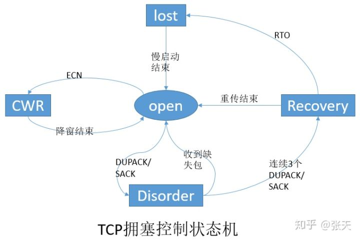

# 计算机与网络

### TCP与UDP

> TCP（Transmission Control Protocol，传输控制协议）是面向连接的协议，在收发数前，必须和对方建立可靠的连接， 一个TCP连接必须要经过三次“对话”才能建立起来。

#### TCP三次握手过程

> **第一次握手：**客户端A将标志位**SYN置为1**,随机产生一个值为**seq=J**（J的取值范围为=1234567）的数据包到服务器，客户端A进入**SYN_SENT**状态，等待服务端B确认；(客户端发送syn和seq到服务端随后客户端SYN_SENT模式)
> **第二次握手：**服务端B收到数据包后由标志位SYN=1知道客户端A请求建立连接，服务端B将标志位**SYN和ACK都置为1，将确认序号ack=J+1，随机产生一个值seq=K，**并将该数据包发送给客户端A以确认连接请求，服务端B进入**SYN_RCVD**状态。（服务端通过syn=1知道客户端请求建立连接，随后服务端将标志位syn和ack置为1，将确认序号ack设置为接收到的seq的值加1，并且随机产生一个seq，发给客户端，服务器进入SYN_RCVD状态）
> **第三次握手：**客户端A收到确认后，检查ack是否为J+1，ACK是否为1，如果正确则将标志位**ACK置为1，ack=K+1**，并将该数据包发送给服务端B，发送完毕后客户端进入ESTABLISHED状态，服务端B检查ack是否为K+1，ACK是否为1，如果正确则连接建立成功，服务端B进入**ESTABLISHED**状态，完成三次握手，随后客户端A与服务端B之间可以开始传输数据了。（客户端接收到确认后，检测ack是否为j+1,标志位ack是否为一，如果正确的话就建立连接成功，随后客户端和服务器都进入ESTABLISHED状态。）

#### TCP四次挥手过程

> **第一次挥手：** Client发送一个FIN，(FIN=1，seq=x)用来关闭Client到Server的数据传送，Client进入**FIN_WAIT_1**状态。
> **第二次挥手：** Server收到FIN后，发送一个ACK给Client，(ACK=1，ACKnum=x+1)，确认序号为收到序号+1（与- SYN相同，一个FIN占用一个序号），Server进入**CLOSE_WAIT**状态。
> **第三次挥手：** Server发送一个FIN，(FIN=1，seq=y)，用来关闭Server到Client的数据传送，Server进入**LAST_ACK**状态。
> **第四次挥手：** Client收到FIN后，Client进入**TIME_WAIT**状态，接着发送一个ACK给Server，(ACK=1，ACKnum=y+1)，确认序号为收到序号+1，Server进入**CLOSED**状态，完成四次挥手。

#### 为什么建立连接是三次握手，而关闭连接却是四次挥手呢？

> 这是因为服务端在LISTEN状态下，收到建立连接请求的SYN报文后，把ACK和SYN放在一个报文里发送给客户端。而关闭连接时，当收到对方的FIN报文时，仅仅表示对方不再发送数据了但是还能接收数据，己方也未必全部数据都发送给对方了，所以己方可以立即close，也可以发送一些数据给对方后，再发送FIN报文给对方来表示同意现在关闭连接，因此，己方ACK和FIN一般都会分开发送。

### https与http

> HTTP协议是**超文本传输协议**的缩写，英文是Hyper Text Transfer Protocol。它是从WEB服务器传输超文本标记语言(HTML)到本地浏览器的传送协议。
> HTTPS 协议（HyperText Transfer Protocol over Secure Socket Layer）：一般理解为HTTP+SSL/TLS，通过 SSL证书来验证服务器的身份，并为浏览器和服务器之间的通信进行加密。

#### HTTPS传输数据的流程：

> 1. 首先客户端通过URL访问服务器建立SSL连接。
> 2. 服务端收到客户端请求后，会将网站支持的**证书信息**（证书中包含**公钥**）传送一份给客户端。
> 3. 客户端的服务器开始协商SSL连接的安全等级，也就是信息加密的等级。
> 4. 客户端的浏览器根据双方同意的安全等级，建立会话密钥，然后利用网站的**公钥**将会话密钥加密，并传送给网站。
> 5. 服务器利用自己的**私钥**解密出会话密钥。
> 6. 服务器利用会话密钥加密与客户端之间的通信。

#### HTTPS的缺点

> HTTPS协议多次握手，导致页面的加载时间延长近50%；
> HTTPS连接缓存不如HTTP高效，会增加数据开销和功耗；
> 申请SSL证书需要钱，功能越强大的证书费用越高。
> SSL涉及到的安全算法会消耗 CPU 资源，对服务器资源消耗较大。

### 进程、线程和协程

[参考资料](https://blog.csdn.net/lluozh2015/article/details/105633142#:~:text=%E7%BA%BF%E7%A8%8B%E6%98%AF%E7%B3%BB%E7%BB%9F%E5%88%86%E9%85%8D%E5%A4%84%E7%90%86,%E8%B0%83%E5%BA%A6%E5%AE%8C%E5%85%A8%E7%94%B1%E7%94%A8%E6%88%B7%E6%8E%A7%E5%88%B6%E3%80%82)

#### 进程

> 进程是 **资源分配的最小单位** 。每个进程都有自己的独立内存空间，不同进程通过进程间通信来通信。由于进程比较重量，占据独立的内存，所以上下文进程间的切换开销（栈、寄存器、虚拟内存、文件句柄等）比较大，但相对比较稳定安全。
> 

#### 线程

> **程序执行过程中的最小单元** 。线程能够共享进程的大部分资源，并参与CPU的调度。线程自己基本上不拥有系统资源,只拥有一点在运行中必不可少的资源(如程序计数器,一组寄存器和栈),但是它可与同属一个进程的其他的线程共享进程所拥有的全部资源。线程间通信主要通过共享内存，上下文切换很快，资源开销较少，但相比进程不够稳定容易丢失数据。
> 

#### 进程与线程的区别

> 地址空间:线程是进程内的一个执行单元，进程内至少有一个线程，它们共享进程的地址空间，而进程有自己独立的地址空间
> 资源拥有:进程是资源分配和拥有的单位,同一个进程内的线程共享进程的资源
> 线程是处理器调度的基本单位,但进程不是
> 每个独立的线程有一个程序运行的入口、顺序执行序列和程序的出口，但是线程不能够独立执行，必须依存在应用程序中，由应用程序提供多个线程执行控制

#### 协程

> 协程，又称微线程，一种比线程更加轻量级的存在，协程不是被操作系统内核所管理，而完全是由程序所控制（也就是在用户态执行）。协程的调度完全由用户控制。协程拥有自己的寄存器上下文和栈。协程调度切换时，将寄存器上下文和栈保存到其他地方，在切回来的时候，恢复先前保存的寄存器上下文和栈，直接操作栈则基本没有内核切换的开销，可以不加锁的访问全局变量，所以上下文的切换非常快。

#### 协程与线程的比较

> 一个线程可以多个协程，一个进程也可以单独拥有多个协程，这样python中则能使用多核CPU。
> 线程进程都是同步机制，而协程则是异步
> 协程能保留上一次调用时的状态，每次过程重入时，就相当于进入上一次调用的状态

### 进程间通信

> 管道(Pipe)
> 命名管道(FIFO)
> 消息队列(Message Queue)
> 信号量(Semaphore)
> 共享内存（Shared Memory）
> 套接字（Socket）

### 状态码

> 200 OK - 客户端请求成功
> 301 - 资源（网页等）被永久转移到其它URL
> 302 - 临时跳转
> 400 Bad Request - 客户端请求有语法错误，不能被服务器所理解
> 401 Unauthorized - 请求未经授权，这个状态代码必须和WWW-Authenticate报头域一起使用
> 403 拒绝访问
> 404 - 请求资源不存在，可能是输入了错误的URL
> 500 - 服务器内部发生了不可预期的错误
> 503 Server Unavailable - 服务器当前不能处理客户端的请求，一段时间后可能恢复正常。

### OSI七层模型和TCP/IP分层模型

#### OSI 和TCP/IP 的对应关系和协议

> 

#### OSI模型各层的基本作用

> 
>
> - 物理层
>
> 
>
> - 数据链路层
>
> 
>
> ​	数据链路层数据包	
>
> - 网络层
>
> 
>
> - 传输层
>
> 
>
> - 应用层
>
> 

### ARP 协议

> **地址解析协议**（英语：**A**ddress **R**esolution **P**rotocol，缩写：**ARP**）是一个通过解析[网络层](https://zh.wikipedia.org/wiki/网络层)地址来找寻[数据链路层](https://zh.wikipedia.org/wiki/数据链路层)地址的[网络传输协议](https://zh.wikipedia.org/wiki/网络传输协议)，它在[IPv4](https://zh.wikipedia.org/wiki/IPv4)中极其重要。ARP是通过[网络地址](https://zh.wikipedia.org/wiki/網路位址)来定位[MAC地址](https://zh.wikipedia.org/wiki/MAC地址)。
>
> 所谓**地址解析（address resolution）**就是主机在发送帧前将目标IP地址转换成目标MAC地址的过程。

### 输入url到显示页面的过程

> **输入地址**：当我们开始在浏览器中输入网址的时候，浏览器其实就已经在智能的匹配可能得 url 了，他会从历史记录，书签等地方，找到已经输入的字符串可能对应的 url，然后给出智能提示，让你可以补全url地址。
>
> **浏览器查找域名的 IP 地址**：
>
> 1. 请求一旦发起，浏览器首先要做的事情就是解析这个域名，一般来说，浏览器会==首先查看本地硬盘的 hosts 文件==，看看其中有没有和这个域名对应的规则，如果有的话就直接使用 hosts 文件里面的 ip 地址。
> 2. 如果在本地的 hosts 文件没有能够找到对应的 ip 地址，浏览器会==发出一个 DNS请求到**本地DNS服务器**== 。本地DNS服务器会首先查询它的缓存记录，如果缓存中有此条记录，就可以直接返回结果，此过程是递归的方式进行查询。
> 3. 如果没有，==本地DNS服务器还要向**DNS根服务器**进行查询==。根DNS服务器没有记录具体的域名和IP地址的对应关系，而是告诉本地DNS服务器，你可以==到域服务器上去继续查询==，并给出**域服务器**的地址。这种过程是迭代的过程。
> 4. ==本地DNS服务器继续向域服务器发出请求==，在这个例子中，请求的对象是.com域服务器。.com域服务器收到请求之后，也不会直接返回域名和IP地址的对应关系，而是告诉本地DNS服务器，你的域名的解析服务器的地址。
> 5. ==本地DNS服务器向域名的解析服务器发出请求==，这时就能收到一个域名和IP地址对应关系，本地DNS服务器不仅要把IP地址返回给用户电脑，还要把这个对应关系保存在缓存中，以备下次别的用户查询时，可以直接返回结果，加快网络访问。
>
> 递归查询是指向本地DNS服务器发出请求后，等待肯定和否定，而迭代是本地服务器向根DNS服务器发出请求后，而DNS服务器只是给出下一个DNS服务器的地址，还要本地服务器向写一级DNS服务器发送查询请求直至获得最终答案。
>
> **浏览器向 web 服务器发送一个 HTTP 请求**：
>
> 拿到域名对应的IP地址之后，浏览器会以一个随机端口（1024<端口<65535）向服务器的WEB程序（常用的有httpd,nginx等）80端口发起TCP的连接请求。经过**三次握手**建立连接，这个连接请求到达服务器端后（这中间通过各种路由设备，局域网内除外），进入到网卡，然后是进入到内核的TCP/IP协议栈（用于识别该连接请求，解封包，一层一层的剥开），还有可能要经过Netfilter防火墙（属于内核的模块）的过滤，最终到达WEB程序，最终建立了TCP/IP的连接。
>
> 
>
> **服务器处理请求**：
>
> 后端从在固定的端口接收到TCP报文开始，它会对TCP连接进行处理，对HTTP协议进行解析，并==按照报文格式进一步封装成HTTP Request对象==，供上层使用。
>
> 一些大一点的网站会将你的请求到反向代理服务器中，因为当网站访问量非常大，网站越来越慢，一台服务器已经不够用了。于是将同一个应用部署在多台服务器上，将大量用户的请求分配给多台机器处理。
>
> **服务器返回一个 HTTP 响应**：
>
> 服务器收到了我们的请求，也处理我们的请求，到这一步，它会把它的处理结果返回，也就是返回一个HTPP响应。HTTP响应与HTTP请求相似，HTTP响应也由3个部分构成，分别是：
>
> - 状态行
> - 响应头(Response Header)
> - 响应正文
>
> 状态行由协议版本、数字形式的状态代码、及相应的状态描述，各元素之间以空格分隔。
>
> 响应头部：由关键字/值对组成，每行一对，关键字和值用英文冒号”:”分隔，典型的响应头有：
>
> 响应正文包含着我们需要的一些具体信息，比如cookie，html，image，后端返回的请求数据等等。
>
> **浏览器显示 HTML**：
>
> 浏览器在解析html文件时，会”自上而下“加载，并在加载过程中进行解析渲染。在解析过程中，如果遇到请求外部资源时，如图片、外链的CSS、iconfont等，请求过程是异步的，并不会影响html文档进行加载。
>
> 解析过程中，浏览器首先会解析HTML文件构建DOM树，然后解析CSS文件构建渲染树，等到渲染树构建完成后，浏览器开始布局渲染树并将其绘制到屏幕上。这个过程比较复杂，涉及到两个概念: reflow(回流)和repain(重绘)。DOM节点中的各个元素都是以盒模型的形式存在，这些都需要浏览器去计算其位置和大小等，这个过程称为relow;当盒模型的位置,大小以及其他属性，如颜色,字体,等确定下来之后，浏览器便开始绘制内容，这个过程称为repain。页面在首次加载时必然会经历reflow和repain。reflow和repain过程是非常消耗性能的，尤其是在移动设备上，它会破坏用户体验，有时会造成页面卡顿。所以**我们应该尽可能少的减少reflow和repain**。
>
> 当文档加载过程中遇到js文件，html文档会挂起渲染（加载解析渲染同步）的线程，不仅要等待文档中js文件加载完毕，还要等待解析执行完毕，才可以恢复html文档的渲染线程。因为JS有可能会修改DOM，最为经典的document.write，这意味着，在JS执行完成前，后续所有资源的下载可能是没有必要的，这是js阻塞后续资源下载的根本原因。所以我明平时的代码中，js是放在html文档末尾的。
>
> **JS的解析是由浏览器中的JS解析引擎完成的**，比如谷歌的是V8。JS是单线程运行，也就是说，在同一个时间内只能做一件事，所有的任务都需要排队，前一个任务结束，后一个任务才能开始。但是又存在某些任务比较耗时，如IO读写等，所以需要一种机制可以先执行排在后面的任务，这就是：同步任务(synchronous)和异步任务(asynchronous)。
>
> **JS的执行机制就可以看做是一个主线程加上一个任务队列(task queue)**。同步任务就是放在主线程上执行的任务，异步任务是放在任务队列中的任务。所有的同步任务在主线程上执行，形成一个执行栈;异步任务有了运行结果就会在任务队列中放置一个事件；脚本运行时先依次运行执行栈，然后会从任务队列里提取事件，运行任务队列中的任务，这个过程是不断重复的，所以又叫做事件循环

#### DNS查询的两种方式

> **递归解析**：
>
> 当局部DNS服务器自己不能回答客户机的DNS查询时，它就需要向其他DNS服务器进行查询。此时有两种方式，如图所示的是递归方式。局部DNS服务器自己负责向其他DNS服务器进行查询，一般是先向该域名的根域服务器查询，再由根域名服务器一级级向下查询。最后得到的查询结果返回给局部DNS服务器，再由局部DNS服务器返回给客户端。
>
> **迭代解析**：
>
> 局部DNS服务器不是自己向其他DNS服务器进行查询，而是把能解析该域名的其他DNS服务器的IP地址返回给客户端DNS程序，客户端DNS程序再继续向这些DNS服务器进行查询，直到得到查询结果为止。

### 点对点和端对端

> 数据传输的可靠性是通过数据链路层和网络层的点对点和传输层的端对端保证的。点对点是基于MAC地址或者IP地址，是指一个设备发数据给另外一个设备，这些设备是指直连设备包括网卡，路由器，交换机。端对端是网络连接，应用程序之间的远程通信。

### TCP的滑动窗口

> 每次传输数据都只能发送一个MSS，就需要等待接收方的ACK，这显然会极大的影响传输的速率。在发送数据的时候，最好的方式是一下将所有的数据全部发送出去，然后一起确认。
>
> 滑动窗口协议的基本工作流程就是由接收方通告窗口的大小，这个窗口称为提出窗口，也就是**接收方窗口**。接收方提出的窗口则是被接收缓冲区所影响的，如果数据没有被用户进程使用那么接收方通告的窗口就会相应得到减小，**发送窗口**取决于接收方窗口的大小。**可用窗口**的大小等于接收方窗口减去发送但是没有被确认的数据包大小。

### TCP拥塞控制过程

[参考知乎程序员历小冰的回答](https://zhuanlan.zhihu.com/p/59656144#:~:text=TCP%E5%8D%8F%E8%AE%AE%E6%9C%89%E4%B8%A4%E4%B8%AA,%E5%A4%A7%EF%BC%8C%E7%BD%91%E7%BB%9C%E6%8B%A5%E5%A1%9E%E7%9A%84%E6%83%85%E5%86%B5%E3%80%82)

> TCP协议有两个比较重要的控制算法，一个是流量控制，另一个就是阻塞控制。
> TCP协议通过滑动窗口来进行流量控制，它是控制发送方的发送速度从而使接受者来得及接收并处理。而拥塞控制是作用于网络，它是防止过多的包被发送到网络中，避免出现网络负载过大，网络拥塞的情况。
> 拥塞算法需要掌握其**状态机**和**四种算法**。拥塞控制状态机的状态有五种，分别是**Open**，**Disorder**，**CWR**，**Recovery**和**Loss**状态。四个算法为**慢启动**，**拥塞避免**，**拥塞发生时算法**和**快速恢复**。
> 
>
> #### 1、Open状态
>
> Open状态是拥塞控制状态机的默认状态。这种状态下，当ACK到达时，发送方根据拥塞窗口cwnd(Congestion Window)是小于还是大于慢启动阈值ssthresh(slow start threshold)，来按照慢启动或者拥塞避免算法来调整拥塞窗口。
>
> #### 2 、Disorder状态
>
> 当发送方检测到DACK(重复确认)或者SACK(选择性确认)时，状态机将转变为Disorder状态。在此状态下，发送方遵循飞行(in-flight)包守恒原则，即一个新包只有在一个老包离开网络后才发送，也就是发送方收到老包的ACK后，才会再发送一个新包。
>
> #### 3 、CWR状态
>
> 发送方接收到一个拥塞通知时，并不会立刻减少拥塞窗口cwnd，而是每收到两个ACK就减少一个段，直到窗口的大小减半为止。当cwnd正在减小并且网络中有没有重传包时，这个状态就叫CWR(Congestion Window Reduced，拥塞窗口减少)状态。CWR状态可以转变成Recovery或者Loss状态。
>
> #### 4 、Recovery状态
>
> 当发送方接收到足够(推荐为三个)的DACK(重复确认)后，进入该状态。在该状态下，拥塞窗口cnwd每收到两个ACK就减少一个段(segment)，直到cwnd等于慢启动阈值ssthresh，也就是刚进入Recover状态时cwnd的一半大小。 发送方保持 Recovery 状态直到所有进入 Recovery状态时正在发送的数据段都成功地被确认，然后发送方恢复成Open状态，重传超时有可能中断 Recovery 状态，进入Loss状态。
>
> #### 5 、Loss状态
>
> 当一个RTO(重传超时时间)到期后，发送方进入Loss状态。所有正在发送的数据标记为丢失，拥塞窗口cwnd设置为一个段(segment)，发送方再次以慢启动算法增大拥塞窗口cwnd。
> Loss 和 Recovery 状态的区别是:Loss状态下，拥塞窗口在发送方设置为一个段后增大，而 Recovery 状态下，拥塞窗口只能被减小。Loss 状态不能被其他的状态中断，因此，发送方只有在所有 Loss 开始时正在传输的数据都得到成功确认后，才能退到 Open 状态。
>
> #### 6、四大算法
>
> >  拥塞控制主要是四个算法：1）慢启动，2）拥塞避免，3）拥塞发生，4）快速恢复。
> >
> > 
> >
> > ##### 慢热启动算法 – Slow Start
> >
> > 所谓慢启动，也就是TCP连接刚建立，一点一点地提速，试探一下网络的承受能力，以免直接扰乱了网络通道的秩序。
> >
> > 慢启动算法：
> >
> > 
> >
> > 1) 连接建好的开始先初始化拥塞窗口cwnd大小为1，表明可以传一个MSS大小的数据。 2) 每当收到一个ACK，cwnd大小加一，呈线性上升。 3) 每当过了一个往返延迟时间RTT(Round-Trip Time)，cwnd大小直接翻倍，乘以2，呈指数让升。 4)为了防止cwnd增长过大引起网络拥塞， 还需设置一个慢开始门限ssthresh状态变量（slow start threshold），ssthresh的用法如下：当cwnd<ssthresh时，使用慢开始算法。当cwnd>ssthresh时，改用拥塞避免算法。当cwnd=ssthresh时，慢开始与拥塞避免算法任意
> >
> > ##### 拥塞避免算法 – Congestion Avoidance
> >
> > 拥塞避免算法让拥塞窗口缓慢增长，即每经过一个往返时间RTT就把发送方的拥塞窗口cwnd加1，而不是加倍。这样拥塞窗口按线性规律缓慢增长。
> >
> > 如果阻塞就把慢开始门限ssthresh设置为出现拥塞时的发送窗口大小的一半（但不能小于2）。然后把拥塞窗口cwnd重新设置为1，执行慢开始算法。这样做的目的就是要迅速减少主机发送到网络中的分组数，使得发生拥塞的路由器有足够时间把队列中积压的分组处理完毕。
> >
> > 
> >
> > ##### 快重传算法
> >
> > 快重传要求接收方在收到一个失序的报文段后就立即发出重复确认（为的是使发送方及早知道有报文段没有到达对方，可提高网络吞吐量约20%）而不要等到自己发送数据时捎带确认。快重传算法规定，发送方只要一连收到三个重复确认就应当立即重传对方尚未收到的报文段，而不必继续等待设置的重传计时器时间到期。如下图：
> >
> > 
> >
> > ##### 快速恢复算法 – Fast Recovery
> >
> > 当发送方连续收到三个重复确认时，就执行“乘法减小”算法，把ssthresh门限减半（为了预防网络发生拥塞）。但是接下去并不执行慢开始算法
> > 考虑到如果网络出现拥塞的话就不会收到好几个重复的确认，所以发送方现在认为网络可能没有出现拥塞。所以此时不执行慢开始算法，而是将cwnd设置为ssthresh减半后的值，然后执行拥塞避免算法，使cwnd缓慢增大。
> >
> > 

### SYN泛洪攻击

> 在三次握手过程中，服务器发送 SYN-ACK 之后，收到客户端的 ACK 之前的 TCP 连接称为半连接(half-open connect)。此时服务器处于 SYN_RCVD 状态。当收到 ACK 后，服务器才能转入 ESTABLISHED 状态.
>
> SYN 攻击指的是，攻击客户端在短时间内伪造大量不存在的IP地址，向服务器不断地发送SYN包，服务器回复确认包，并等待客户的确认。由于源地址是不存在的，服务器需要不断的重发直至超时，这些伪造的SYN包将长时间占用未连接队列，正常的SYN请求被丢弃，导致目标系统运行缓慢，严重者会引起网络堵塞甚至系统瘫痪。
>
> SYN 攻击是一种典型的 DoS/DDoS 攻击。检测 SYN 攻击非常的方便，当你在服务器上看到大量的半连接状态时，特别是源IP地址是随机的，基本上可以断定这是一次SYN攻击。在 Linux/Unix 上可以使用系统自带的 netstats 命令来检测 SYN 攻击。
>
> SYN攻击不能完全被阻止，除非将TCP协议重新设计。我们所做的是尽可能的减轻SYN攻击的危害，常见的防御 SYN 攻击的方法有如下几种：
>
> - 缩短超时（SYN Timeout）时间
> - 增加最大半连接数
> - 过滤网关防护
> - SYN cookies技术

### HTTP1.0、1.1、2.0

[参考资料](https://www.debugger.wiki/article/html/1565502376358922)

> http/1.0 :
>
> 1. 默认不支持长连接，需要设置==keep-alive==参数指定
> 2. 强缓存expired、协商缓存last-modified\if-modified-since 有一定的缺陷
>
> http 1.1 :
>
> 1. 默认长连接(keep-alive)，可以被多个请求复用，不用声明，但是同一个TCP连接里面，所有的数据通信是**按次序进行**的。服务器只有处理完一个请求，才会接着处理下一个请求。如果前面的处理特别慢，后面就会有许多请求排队等着。这将导致“队头堵塞”
> 2. 增加了强缓存cache-control、协商缓存etag\if-none-match 是对http/1 缓存的优化
>
> http/2 :
>
> 1. 多路复用，一个Tcp中多个http请求是并行的 (雪碧图、多域名散列等优化手段http/2中将变得多余)
> 2. 二进制格式编码传输
> 3. header压缩机制，头信息使用gzip或compress压缩后再发送，客户端和服务器同时维护一张头信息表，所有字段都会存入这个表，产生一个索引号，之后就不发送同样字段了，只需发送索引号。
> 4. 服务端推送，允许服务器未经请求，主动向客户端发送资源

### SSL连接的过程

> 1. 客户端提交https请求
>
> 2. 服务器响应客户，并把证书公钥发给客户端
>
> 3. 客户端验证证书公钥的有效性
>
> 4. 有效后，会生成一个会话密钥
>
> 5. 用证书公钥加密这个会话密钥后，发送给服务器
>
> 6. 服务器收到公钥加密的会话密钥后，用私钥解密，回去会话密钥
>
> 7. 户端与服务器双方利用这个会话密钥加密要传输的数据进行通信

### 对称加密和非对称加密

> **对称加密**就是加密和解密用的是同一个密钥k。
> **非对称加密**是发送端使用公开的公钥a加密，然后接收端使用私密的私钥b解密。
>
> 那https的加密是用的对称加密还是非对称加密呢？
>
> 两者都用了，使用非对称加密传输一个对称密钥K，让服务器和客户端都得知。然后两边都使用这个对称密钥K来加密解密收发数据。因为传输密钥K是用非对称加密方式，很难破解比较安全。而具体传输数据则是用对称加密方式**

### Session和Cookie

> 因为HTTP协议是一个无状态协议，即Web应用程序无法区分收到的两个HTTP请求是否是同一个浏览器发出的。为了跟踪用户状态，服务器可以向浏览器分配一个唯一ID，并以Cookie的形式发送到浏览器，浏览器在后续访问时总是附带此Cookie，这样，服务器就可以识别用户身份。
>
> 我们把这种基于唯一ID识别用户身份的机制称为Session。每个用户第一次访问服务器后，会自动获得一个Session ID。如果用户在一段时间内没有访问服务器，那么Session会自动失效，下次即使带着上次分配的Session ID访问，服务器也认为这是一个新用户，会分配新的Session ID。而服务器识别Session的关键就是依靠一个名为`JSESSIONID`的Cookie。

### 物理地址、虚拟地址和逻辑地址

> 

###  ipv6和ipv4

> iPv4使用32位（4字节）地址，大约可以存储43亿个地址，IPv6的地址长度为128位，可支持340多万亿个地址。
>
> 与IPv4相比，IPv6将地址长度从32位增加到了128位，可支持更多的地址需求。
>
> IPv4根据提供的IP选项，有20~60个字节的可变长度；而IPv6拥有40个字节的固定长度，相对于IPv4而言报头简单。
>
> 于IPv4而言，互联网安全协议（IPsec）是可选的，但不一定是免费的，有的需要付费支持；但对于IPv6来说，互联网安全协议是必选项。此外，像身份验证、数据一致性和保密性的内容也加入到了IPv6中。由此说明，IPv6相对于IPv4来说，更加安全。
>
> 

### NIO、BIO、AIO

> **BIO**：`同步并阻塞`（传统阻塞型），服务器实现模式为一个连接一个线程，即客户端有连接请求时服务器端就需要启动一个线程进行处理，如果这个连接不作任何事情会造成不必要的线程开销，可以通过线程池机制改善。
>
> **NIO**：`同步非阻塞`，服务器实现模式为一个线程处理多个请求(连接)，即客户端发送的连接请求会被注册到多路复用器上，多路复用器轮询到有 I/O 请求就会进行处理。NIO 有**三大核心**部分：`Channel（管道）`、`Buffer（缓冲区）`、`Selector（选择器）`。
>
> **AIO**：`异步非阻塞`，AIO 引入了异步通道的概念，采用了 Proactor 模式，简化了程序编写，有效的请求才启动线程，它的特点是先由操作系统完成后才通知服务端程序启动线程去处理，一般适用于连接数较多且连接时间较长的应用。
>
> - BIO 方式适用于`连接数比较小且固定`的架构，这种方式对服务器资源要求比较高，并发局限于应用中，JDK1.4 之前唯一的选择，程序较为简单容易理解。
> - NIO 方式适用于`连接数目多且连接比较短`的架构，比如聊天服务器，弹幕系统，服务器间通讯等，编程比较复杂，JDK1.4 开始支持。
> - AIO 方式适用于`连接数目多且连接比较长`的架构，比如相册服务器，充分调用 OS 参与并发操作，变成比较复杂，JDK7 开始支持。
>
> ####  NIO 和 BIO 对比
>
> 1. BIO 以流的方式处理数据，而 NIO 以块的方式处理数据，块 I/O 的效率比流 I/O 高很多。
> 2. BIO 是阻塞的，而 NIO 是非阻塞的。
> 3. BIO 基于字节流和字符流进行操作，而 NIO 基于 Channel（通道）和 Buffer（缓冲区）进行操作，数据总是从通道读取到缓冲区中，或者从缓冲区写入到通道中。Selector（选择器）用于监听多个通道事件（比如连接请求，数据到达等），因此`使用单个线程就可以监听多个客户端通道`。

### 并发与并行

> 并发：在操作系统中，某一时间段，几个程序在同一个CPU上运行，但在任意一个时间点上，只有一个程序在CPU上运行。
>
> 当有多个线程时，如果系统只有一个CPU，那么CPU不可能真正同时进行多个线程，CPU的运行时间会被划分成若干个时间段，每个时间段分配给各个线程去执行，一个时间段里某个线程运行时，其他线程处于挂起状态，这就是并发。并发解决了程序排队等待的问题，如果一个程序发生阻塞，其他程序仍然可以正常执行。
>
> 并行：当操作系统有多个CPU时，一个CPU处理A线程，另一个CPU处理B线程，两个线程互相不抢占CPU资源，可以同时进行，这种方式成为并行。
>
> 区别
>
> 1. 并发只是在宏观上给人感觉有多个程序在同时运行，但在实际的单CPU系统中，每一时刻只有一个程序在运行，微观上这些程序是分时交替执行。
> 2. 在多CPU系统中，将这些并发执行的程序分配到不同的CPU上处理，每个CPU用来处理一个程序，这样多个程序便可以实现同时执行。

### 301 和 302 的区别

> 301和302状态码都表示重定向，就是说浏览器在拿到服务器返回的这个状态码后会自动跳转到一个新的URL地址，这个地址可以从响应的Location首部中获取（用户看到的效果就是他输入的地址A瞬间变成了另一个地址B）——这是它们的共同点。
>
> 他们的不同在于。301表示旧地址A的资源已经被永久地移除了（这个资源不可访问了），搜索引擎在抓取新内容的同时也将旧的网址交换为重定向之后的网址；
>
> 302表示旧地址A的资源还在（仍然可以访问），这个重定向只是临时地从旧地址A跳转到地址B，搜索引擎会抓取新的内容而保存旧的网址。302在搜索引擎seo是有好处，站内跳转、站外跳转。

### Http常见字段

> #### host字段
>
> 客户端发送请求时，可以用来指定服务器域名
>
> #### Content—Length字段
>
> 服务器在返回数据时，会有Content—Length字段，表明本次回应的数据长度
>
> #### Connection字段
>
> 常用于客户端要求服务器使用tcp持久连接，以便其他请求复用，http 1.1版本默认连接都是持久连接，但是为了兼容老版本的http，需要指定Connection首部字段的值为为keep-Alive
>
> #### Content-Type字段
>
> 用于服务器回应时，告诉客户端本次数据是用什么格式。`Content-Type：text/html;charset=utf-8`，上面的类型声明，发送的是网页，且编码是UTF-8。客户端请求的时候，可以使用Accept字段声明自己可以接收哪些数据格式。
>
> #### Content-Encoding字段
>
> 说明数据的压缩方法，表示服务端返回的数据使用什么压缩格式，例如`Content-Encoding:gzip`,上面表示服务器返回数据采用gzip方式压缩，告知客户端需要用此方式解压，客户端在请求时，用Accept-Encoding字段说明自己可以接收哪些压缩方式、Accept-Enconding:gzip,deflat

### http2相比http1.1性能上的改进

> #### 头部压缩
>
> HTTP/2 会压缩头（Header）如果你同时发出多个请求，他们的头是⼀样的或是相似的，那么，协议会帮你消除重 复的部分。 这就是所谓的 HPACK 算法：在客户端和服务器同时维护⼀张头信息表，所有字段都会存⼊这个表，⽣成⼀个索 引号，以后就不发送同样字段了，只发送索引号，这样就提⾼速度了。
>
> #### 二进制格式
>
> HTTP/2 不再像 HTTP/1.1 ⾥的纯⽂本形式的报⽂，⽽是全⾯采⽤了⼆进制格式，头信息和数据体都是⼆进制，并 且统称为帧（frame）：头信息帧和数据帧
>
> #### 数据流
>
> HTTP/2 的数据包不是按顺序发送的，同⼀个连接⾥⾯连续的数据包，可能属于不同的回应。因此，必须要对数据 包做标记，指出它属于哪个回应。 每个请求或回应的所有数据包，称为⼀个数据流（ Stream ）。每个数据流都标记着⼀个独⼀⽆⼆的编号，其中规 定客户端发出的数据流编号为奇数， 服务器发出的数据流编号为偶数 客户端还可以指定数据流的优先级。优先级⾼的请求，服务器就先响应该请求。
>
> #### 多路复用
>
> HTTP/2 是可以在⼀个连接中并发多个请求或回应，⽽不⽤按照顺序⼀⼀对应。 移除了 HTTP/1.1 中的串⾏请求，不需要排队等待，也就不会再出现「队头阻塞」问题，降低了延迟，⼤幅度提⾼ 了连接的利⽤率。 举例来说，在⼀个 TCP 连接⾥，服务器收到了客户端 A 和 B 的两个请求，如果发现 A 处理过程⾮常耗时，于是就 回应 A 请求已经处理好的部分，接着回应 B 请求，完成后，再回应 A 请求剩下的部分。
>
> #### 服务器推送
>
> HTTP/2 还在⼀定程度上改善了传统的「请求 - 应答」⼯作模式，服务不再是被动地响应，也可以主动向客户端发 送消息。 举例来说，在浏览器刚请求 HTML 的时候，就提前把可能会⽤到的 JS、CSS ⽂件等静态资源主动发给客户端，减 少延时的等待，也就是服务器推送

### http2有哪些缺陷，http3做了哪些优化

> http2的主要问题在于，多个http请求在复用一个tcp连接，下层的tcp协议不知道有多少个http请求，所以一旦发生丢包现象，就会触发tcp的重传机制，这样在一个tcp的连接中的所有的http请求都必须等待这个丢了的包重传回来。
>
> 所以http3把http下层的tcp协议改成了udp协议
>
> 

### TSL握手

> #### 第一次握手
> 客户端会发送一个client hello消息，消息里面有客户端使用的tsl版本、支持的密码套件列表、以及生成的随机数，这个随机数会被服务端保留，他是生成对称加密秘钥的材料之一
> #### 第二次握手
> 服务端收到客户端的client hello消息后，会确认tls版本号是否支持，和从密码套件列表中选择一个密码套件，以及生成随机数。接着，返回server hello消息，消息里面有服务器确认的tls版本号，也给出了随机数，然后从客户端的密码套件列表中选择一个合适的密码套件。
>
> 客户端和服务端分别都会生成一个随机数并把随机数传个对方，这个睡就睡是后续生成会话秘钥的条件，所谓的会话密钥就是数据传输时，所使用的对称加密秘钥。
>
> 然后服务端为了证明自己的身份，会发送server certificate给客户端，这个消息里含有数字证书。
>
> 随后服务端发送server hello done消息，目的是告诉客户端，数据已经发送完了。
>
> #### 第三次握手
>
> 客户端验证完证书后，客户端就会生成一个新的随机数，用服务器的RSA公钥加密该随机数，发送change cipher key exchange消息发送给服务端，服务端收到后，用RSA私钥解密，得到客户端发来的随机数。至此一共生成了三个随机数，双方根据已得到的三个随机数生成会话秘钥，他是对称秘钥，用户后续的http请求数据的加解密。
>
> 生成秘钥后，客户端发送change cipher spec消息，告诉服务端开始使用加密方式发送消息。
>
> 然后发送encrypted handshake message消息，把之前所有发送的数据做个摘要，再用会话秘钥加密后让服务器做个验证，验证加密通信是否可用和之前握手的信息是否有被篡改。
>
> #### 第四次握手
>
> 服务器发送change cipher spec和encrypted handshake message消息，如果双方都验证加密解密没有问题，那么握手正式完成。

### https优化

> #### 硬件优化
>
> https协议是计算机密集型，而不是io密集型，所以不能把钱花在网卡硬盘等地方，而是应该花在CPU上，因为HTTPS连接过程中有大量的计算秘钥的过程，另外如果可以应该选择可以支持AES-NI特性的CPU，因为这种款式的CPU能在指令集别优化了AES算法。
>
> #### 协议优化
>
> tls 1.2版本如果使用的是RSA秘钥交换算法那么需要4次握手，也就是2RTT，才能进行数据传输，而且RSA秘钥贾环算法还不具备前向安全性，如果可以，尽量使用ECDHE密钥交换算法替换RSA算法，因为该算法由于⽀持「False Start」，它是“抢跑” 的意思，客户端可以在 TLS 协议的第 3 次握⼿后，第 4 次握⼿前，发送加密的应⽤数据，以此将 TLS 握⼿的消息 往返由 2 RTT 减少到 1 RTT，⽽且安全性也⾼，具备前向安全性。ECDHE算法基于椭圆曲线实现的，不同的椭圆曲线性能也不相同，尽量选择下5519曲线。
>
> #### 会话复用
>
> TLS 握⼿的⽬的就是为了协商出会话密钥，也就是对称加密密钥，那我们如果我们把⾸次 TLS 握⼿协商的对称加 密密钥缓存起来，待下次需要建⽴ HTTPS 连接时，直接「复⽤」这个密钥

### TCP和UDP的区别

> #### 连接
>
> tcp是面向连接的传输层协议，传输数据前要先建立连接
>
> udp是不需要连接的，即刻传输数据
>
> #### 服务对象
>
> tcp是一对一的两点通信，而udp支持一对一、一对多、多对多交互通信
>
> #### 可靠性
>
> TCP 是可靠交付数据的，数据可以⽆差错、不丢失、不᯿复、按需到达。 
>
> UDP 是尽最⼤努⼒交付，不保证可靠交付数据。
>
> #### 首部开销
>
> tcp首部长度较长，会有一定的开销，首部在没有使用选项字段时是20个字节，如果使用了选项字段则会变更长。udp首部只有8个字节，并且固定不变
>
> 

### SYN攻击

>1、修改linux内核参数
>
>控制队列⼤⼩和当队列满时应做什么处理，当网卡接收数据包的速度大于内核处理速度是，会有一个队列保存这些数据包，控制该队列的最大值如下参数：net.core.netdev_max_backlog。SYN_RCVD状态连接的最大个数:net.ipv4.tcp_max_syn_backlog，超出处理能力时，对新的SYN直接回报RST，丢弃连接：net.ipv4.tcp_abort_onoverflow
>
>

重传机制、滑动窗口、流量控制、拥塞控制

